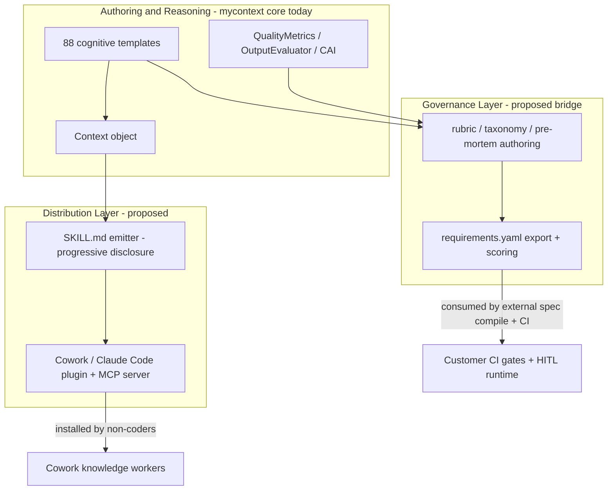

# Agentic Landscape, Skills, and Requirements-as-Code Strategy (2026)

> Research + strategy memo. How mycontext-ai should evolve as the agent ecosystem
> standardizes on **Agent Skills**, **plugins/marketplaces** (Claude Cowork, Claude
> Code), **agent-native applications** (agents that author their own skills,
> subagents, and hooks), and **requirements-as-code / eval-first specs**.
>
> Companion docs (do not duplicate): [STRATEGIC_MARKET_PLAN_2026.md](./STRATEGIC_MARKET_PLAN_2026.md),
> [SKILL_ARCHITECT_RESEARCH.md](./SKILL_ARCHITECT_RESEARCH.md), `BRAINSTORM_NEXT_FRONTIERS.md`.
> External reference framework: the "Requirements & Eval-First Specification" pack
> (the *Fable* requirements pack) — cited, not vendored.

Last updated: June 2026

---

## 0. Addendum — Option A shipped (offline, $0)

> Added after implementation. This memo's strategy was adopted with one decisive
> simplification: **everything ships offline in the open-source PyPI package, at
> zero server cost.**

What was actually built:

- **All 88 cognitive patterns are open source** and ship in the PyPI wheel. There
  are no license tiers anywhere (SDK, web app, frontend, or DB). The old
  `activate_license` / `is_enterprise_active` functions remain only as deprecated
  no-op shims for one release.
- **Skills + CLI + local MCP (this memo's distribution layer)** are implemented
  **locally**: `mycontext skills export` emits progressive-disclosure `SKILL.md`
  packages (and an optional Claude Code / Cowork plugin directory), and
  `mycontext mcp` runs a **local stdio MCP server** exposing `suggest_patterns`,
  `transform`, and `score_output`. The hosted distribution/marketplace server
  bits described later in this memo are **dropped in favor of the local MCP** —
  no PAT, no inference cost, no hosting cost.
- **Requirements-as-Code (the governance layer)** is implemented as an
  **authoring + scoring bridge only** (`mycontext.rac`): it drafts a
  `requirements.yaml` from cognitive patterns and scores outputs with the eval
  stack. **Anti-goal (confirmed and enforced in code):** mycontext does *not*
  ship a requirements compiler, a CI gate executor, or a human-in-the-loop /
  budget runtime. The customer's own stack enforces the spec.

Net effect: PyPI hosts the package for free, users run everything offline with
their own LLM key, and mycontext stays a **library**, not a platform. The
sections below are preserved as the original research/strategy; read them through
the lens of this addendum.

---

## 1. Executive summary + recommendation

The agent ecosystem is converging on three layers that sit *around* the model:

1. A **distribution layer** — Agent Skills (`SKILL.md`, an open standard) bundled into
   **plugins** (skills + subagents + hooks + MCP) installed from marketplaces in Claude
   Cowork, Claude Code, Cursor, and others.
2. A **governance layer** — **requirements-as-code**: the eval set, rubrics, action-risk
   matrix, budgets, and release gates become the machine-readable spec the system obeys.
3. An **authoring layer** — the AI-native pattern where agents increasingly *write their
   own* skills/subagents/hooks instead of humans hand-writing prompts.

mycontext-ai already owns a fourth thing none of these define: **how the model should
reason** — structured `Context` objects built from 88 research-backed cognitive patterns,
plus a measurement stack (QualityMetrics, OutputEvaluator, CAI) that proves reasoning lift.

**Recommendation in one line:** position mycontext as the **reasoning-quality layer** that
*plugs into* the distribution and governance layers rather than rebuilding them.

Concretely:

- **Do (high confidence): templates as progressive-disclosure Skills.** Emit `SKILL.md`
  packages (and Cowork/Claude Code plugins) directly from templates. This is low-risk,
  reuses the existing `Skill`/`SkillRunner`, and is the single highest-leverage way to
  reach non-coding users. Verdict: **strong yes.**
- **Do (medium confidence): a requirements-as-code *authoring + scoring bridge*.** Use
  cognitive templates to help users *write* the spec artifacts (task taxonomy, rubrics,
  pre-mortem, risk matrix) and use the eval stack to *score* them — then emit a standard
  `requirements.yaml`. Verdict: **good idea, but only as authoring + scoring, not as a
  runtime.**
- **Don't (explicit anti-goal): become a requirements-as-code *runtime*.** Do not build
  the `spec compile` compiler, the CI gate executor, or the HITL/approval engine. That
  overlaps with eval platforms (DeepEval, LangSmith, Braintrust) and agent frameworks, and
  it is where mycontext has no advantage. Stay the layer that produces *better inputs* and
  *measures quality*; let the customer's stack enforce.
- **Do: broaden the audience.** Today's framing is coding/eng tiers. Add a horizontal
  "reasoning skills for knowledge workers" surface (installable in Cowork) so a PM,
  analyst, or support lead gets value without writing Python.

**Why this is the right shape:** every competitor can ship templates and every host now
ships a skills format. The defensible wedge is *measurable reasoning quality* (CAI) plus
*one source of reasoning that exports to every host and every framework*. Skills and
requirements-as-code are the **distribution and governance rails**; mycontext should ride
them, not lay its own.

---

## 2. The 2026 agentic landscape

### 2.1 Agent Skills + progressive disclosure

A **skill** is a directory with a `SKILL.md` file (YAML frontmatter + Markdown body),
optionally bundling `scripts/`, `references/`, and assets. The format originated at
Anthropic, was released as an open standard (`agentskills.io`), and is now adopted across
multiple agent products.

The core design principle is **progressive disclosure** — three tiers that keep context
cost near-zero until a skill is actually needed:

| Tier | What loads | When | Token cost |
|------|-----------|------|------------|
| 1. Discovery | `name` + `description` (frontmatter) | session start | ~50-100 tokens/skill |
| 2. Activation | full `SKILL.md` body | when a task matches the description | < ~5,000 tokens (recommended) |
| 3. Resources | bundled `references/`, `scripts/`, assets | only when the body references them | varies |

Authoring rules that matter for us: `SKILL.md` must be exactly that filename; keep the body
under ~500 lines / 5k words; push depth into `references/` with explicit "load when X"
triggers; the `description` carries the trigger signal and must say *what* and *when*;
scripts run via the host and their *output* (not their source) enters context.

### 2.2 Plugins and marketplaces (Claude Cowork, Claude Code)

A **plugin** is a package that bundles several component types in one install:

- **Skills** — reusable instructions/procedures the model invokes autonomously.
- **Subagents** (`agents/`) — specialized, isolated Claude instances for delegated tasks.
- **Hooks** (`hooks/hooks.json`) — scripts that run on lifecycle events (e.g. `PreToolUse`,
  `Stop`); guaranteed to run, used for safety/formatting/policy.
- **MCP connectors** — external tools/data via the Model Context Protocol.

Plugins are distributed via marketplaces or any Git repo, can be org-required, and in
Cowork are installable by **non-developers** through a UI ("Skills and agents appear as
tabs; connectors and hooks have their own pages"). This is the channel that reaches users
who will never `pip install` anything.

### 2.3 Agent-native applications

The emerging pattern: instead of a human hand-writing one prompt, the agent **assembles
its own scaffolding** — selecting/authoring skills, spawning subagents, and registering
hooks for the task at hand. Skills are explicitly "model-invoked"; subagents are delegated
to; hooks fire deterministically. The human writes intent and constraints; the agent writes
the procedure. This raises the value of a *library of high-quality, measurable reasoning
procedures* the agent can pull from — which is exactly what mycontext templates are.

### 2.4 Requirements-as-code / eval-first specs (the Fable pack)

A parallel, less hyped but more rigorous trend: treat the **eval set as the spec**. The
referenced framework replaces unfalsifiable "shall" statements with machine-readable,
enforceable artifacts in a single `requirements.yaml`:

- **Task taxonomy** (`tasks:`) — what the agent handles/refuses, with frequency + risk.
- **Rubrics** (`rubrics:`) — 5-8 yes/no criteria per task, each with an *anchor* (where to
  look, what counts), graded by `code | judge | human`.
- **Action risk matrix** (`actions:`) — per-tool `auto | approve | forbidden` + graduation
  clauses → compiles to HITL config.
- **Pre-mortem safety** (`safety:`) — imagined incidents → requirement + hard-gated test.
- **Budgets** (`budgets:`) — hard cost/step/time limits enforced by infrastructure.
- **Datasets** (`datasets:`) — frozen regression vs tunable dev, anonymization, flywheel.
- **Gates** (`gates:`) — CI pass marks; `hard_gate: true` = one violation blocks release.

A `spec compile` step turns the YAML into judge prompts, policy config, a traceability
index (typed IDs `T*/R-*/A-*/P*/G-*/EV-*`), and CI gate checks. Critically, the schema is
fed to **coding agents** via `CLAUDE.md` + an `implementing-requirements` skill +
progressive disclosure — so requirements-as-code and Agent Skills are already converging in
practice. This is the governance layer mycontext should *author for*, not *operate*.

### 2.5 How the layers fit together



---

## 3. Where mycontext sits today

### 3.1 Strengths (the assets to leverage)

- **The `Context` object** — Guidance + Directive + Constraints + Knowledge, assembled with
  research-backed ordering, provider-tuned rendering (XML for Anthropic/Gemini), and 13
  export formats (`to_messages`, `to_anthropic`, `to_openai`, `to_google`, `to_langchain`,
  `to_crewai`, `to_autogen`, `to_llamaindex`, JSON/YAML/XML/Markdown, `to_prompt`).
- **88 cognitive patterns** — `Pattern.build_context()` (rich, zero-LLM) vs `GENERIC_PROMPT`
  (concise, zero-LLM), depth parameter (quick/standard/thorough). 16 free + ~72 enterprise.
- **Intelligence layer** — `transform()` (auto pattern selection), `smart_execute()`
  (complexity router), `suggest_patterns()`, `build_workflow_chain()`,
  `TemplateIntegratorAgent` (multi-template fusion), `PromptComposer`, `generate_context()`,
  `PromptArchitect` (legacy-prompt rescue).
- **The measurement stack (the moat)** — `QualityMetrics` (prompt-side, 6 dims),
  `OutputEvaluator` (output-side, 7 dims incl. Cognitive Scaffolding), `ContextAmplification
  Index` (CAI = templated/raw), `TemplateBenchmark`. Few competitors can *prove* lift.
- **SDK Skills already exist** — `Skill` parses `SKILL.md`; `SkillRunner` builds context,
  evaluates quality, optionally executes, and gates below `quality_threshold`; skills can
  declare `pattern: comparative_analyzer` and the runner **fuses** the skill body with that
  pattern's `build_context()`. `Context.from_skill(path, task=...)` exists.
- **Framework helpers** — LangChain, LlamaIndex, CrewAI, AutoGen, DSPy, Semantic Kernel,
  Google ADK via `integrations/helpers.py` and `auto_integrate()`.

### 3.2 Gaps (what the landscape now demands)

- **No `SKILL.md` / plugin *emitter*.** mycontext can *consume* a `SKILL.md`, but it cannot
  *produce* progressive-disclosure skill packages or Cowork/Claude Code plugins from its
  own templates. The 88 patterns are trapped behind a Python import.
- **No distribution to non-coders.** There is no Cowork-installable artifact and no MCP
  server exposing `transform`/`suggest_patterns` to a host. Reach is limited to people who
  write Python.
- **No requirements-as-code bridge.** No `requirements.yaml` import/export, no template path
  that authors taxonomies/rubrics/pre-mortems, despite owning the eval primitives that would
  score them.
- **Coding/eng-tier framing only.** The 5-tier adoption model (see
  [STRATEGIC_MARKET_PLAN_2026.md](./STRATEGIC_MARKET_PLAN_2026.md)) targets engineers,
  platform teams, eval/research, prompt leaders, and partners — all technical. There is no
  horizontal "reasoning skills for any knowledge worker" surface.
- **Two "skills" systems still confuse.** SDK `SkillRunner` demos vs `.cursor/skills/` dev
  workflows (noted in `AGENTS.md`). A public skills story must be unambiguous about which is
  which.

---

## 4. Idea 1 — Templates as Skills (progressive disclosure)

**The mapping is almost one-to-one**, which is why this is the highest-leverage move:

- **Tier 1 (Discovery → frontmatter):** template `name` + `description`. mycontext already
  has both on every `Pattern`. The description doubles as the skill *trigger* — minor
  tightening needed so it says *what + when* per the authoring rules.
- **Tier 2 (Activation → `SKILL.md` body):** the template's `GENERIC_PROMPT` (concise,
  already 600-1200 chars) or a distilled `build_context()` body becomes the instructions.
  This naturally respects the < 5k-word budget.
- **Tier 3 (Resources → `references/`):** the research citations behind each pattern,
  `input_schema`/`output_schema`, and depth variants (quick/standard/thorough) become
  bundled reference files loaded "only when X." Optionally a `scripts/` entry can call the
  SDK (e.g. run `OutputEvaluator`) for hosts that allow execution.

```
mycontext-root-cause-analysis/
  SKILL.md            # name+description (T1), GENERIC_PROMPT body (T2)
  references/
    methodology.md    # Five Whys / Ishikawa depth, research citations (T3)
    schema.md         # input/output contract (T3)
  scripts/            # optional: score_output.py -> OutputEvaluator (T3)
```

**Why it's strong and low-risk:**

- Reuses the existing `Skill`/`SkillRunner` and `pattern:` fusion — the inverse direction
  (template → `SKILL.md`) is new but mechanical.
- It is the cheapest path to non-coder reach: a generated skill is installable in Cowork
  with no Python.
- It aligns with the conclusion already reached in
  [SKILL_ARCHITECT_RESEARCH.md](./SKILL_ARCHITECT_RESEARCH.md): pursue **validated
  multi-host export integrated with `mycontext.skills`**, not a greenfield "universal skill
  maker." This idea *is* that export, sourced from the template catalog.

**Verdict: strong yes.** This is the anchor of Phase 1.

---

## 5. Idea 2 — Requirements-as-Code (analysis + verdict)

The Fable pack is rigorous and maps cleanly onto assets mycontext already has. Walking it
section by section against mycontext:

- **Task taxonomy (`tasks:`)** — "what the agent is for, how often, how risky." mycontext
  has templates that *produce* exactly this analysis (`question_analyzer`,
  `intent_recognizer`, `stakeholder_mapper`). Authoring fit: high.
- **Rubrics (`rubrics:`) with anchors** — 5-8 yes/no criteria, graded code/judge/human.
  This is conceptually identical to `OutputEvaluator`'s dimensions and the
  `code_reviewer`/`socratic_questioner` style of criterion generation. mycontext can *draft*
  rubrics and, more uniquely, *score* candidate outputs against them. Fit: high — and this
  is where the CAI/eval moat directly applies.
- **Action risk matrix (`actions:`)** — per-tool auto/approve/forbidden + graduation. The
  `risk_assessor` template maps here. But the *enforcement* (HITL config, tool allowlist) is
  runtime. Authoring fit: high; runtime fit: out of scope.
- **Pre-mortem safety (`safety:`)** — imagined incident → requirement + hard-gated test.
  `scenario_planner` + `risk_assessor` + `conflict_resolver` are a natural authoring engine
  for this. Fit: high.
- **Budgets / datasets / gates / `spec compile`** — pure runtime and infrastructure
  (gateway limits, frozen regression hashing, CI gate evaluation, judge-prompt generation).
  mycontext has **no advantage** here and several incumbents do.

### 5.1 Verdict

**Good idea — but only as an authoring + scoring bridge, not as a standalone RaC runtime.**

mycontext should:

- **Author** the human-judgment-heavy artifacts (taxonomy, rubrics, pre-mortem, risk matrix)
  using cognitive templates — turning a vague intent into draft spec sections.
- **Score** candidate agent outputs and candidate rubrics with the existing eval stack
  (OutputEvaluator/CAI), and report which criteria a draft fails.
- **Emit** a standard `requirements.yaml` in the established shape so the customer's existing
  `spec compile` / CI / HITL stack consumes it unchanged.

### 5.2 Explicit scope boundaries (anti-goals)

mycontext must **not** build:

- the `spec compile` compiler or the generated `policies.py` / judge-prompt pipeline;
- the CI gate executor or release-bundle/hashing machinery;
- the HITL approval engine, budget enforcement, or interrupt runtime;
- a competing eval *platform* (DeepEval, LangSmith, Braintrust already own this) or an
  orchestration/runtime (LangGraph, CrewAI already own this).

The rule of thumb from the wider strategy holds: mycontext makes *better inputs* and
*measures quality*; other layers *enforce* and *run*. Crossing that line is the main risk
(see §10). Pursuing the authoring + scoring bridge keeps mycontext on the right side of it
while making the 88 templates demonstrably useful for serious agent engineering.

---

## 6. Template → agent-engineering capability map

This is the heart of the "how do different templates help different aspects of agent
engineering" question. The agent lifecycle (mirroring the Fable pack: requirements →
design → build → eval → ops) maps onto specific mycontext patterns. Each phase below lists
the templates that *author* the artifact and how the eval stack reinforces it.

### Phase 1 — Requirements & scoping ("what is this agent for?")

- `question_analyzer` — decompose a fuzzy product intent into the real questions the agent
  must answer; the basis of the **task taxonomy** (`tasks:`).
- `intent_recognizer` — classify incoming requests into task types and detect
  out-of-scope/refusal categories (the `T6`-style refusal rows).
- `stakeholder_mapper` — surface who signs off on what (the `meta.signoff` owners: support
  lead, finance, security), so the spec is ratified by the right people.
- `audience_adapter` — frame the same requirement for a BA, an engineer, and an executive
  (matters for non-coder authoring; see §7).

### Phase 2 — Risk, safety & guardrails ("what must it never do?")

- `risk_assessor` — build the **action risk matrix** (`actions:`): per-tool reversibility,
  blast radius, auto/approve/forbidden, graduation clauses.
- `scenario_planner` — run the **pre-mortem** (`safety:`): imagine the six-months-from-now
  incident, derive the requirement and the hard-gated test for each.
- `conflict_resolver` — reconcile competing constraints (cost vs safety, autonomy vs
  control) so budgets and gates are coherent, not contradictory.

### Phase 3 — Rubric & eval design ("how do we know it's good?")

- `code_reviewer` — the criterion-with-anchor discipline (where to look, what counts) maps
  directly to rubric authoring; strongest for code/agent-output review tasks.
- `comparative_analyzer` — A/B candidate outputs and baselines (human vs bare-model vs
  agent) to set honest thresholds.
- `socratic_questioner` — stress-test draft rubric criteria against the stranger/yes-no/
  evidence tests, exposing vague criteria before they ship.
- **`OutputEvaluator` + `ContextAmplificationIndex` (eval stack, not a template)** — *score*
  candidate outputs against the rubric and quantify lift (CAI), the part of
  requirements-as-code where mycontext is uniquely strong.

### Phase 4 — Reasoning & system-prompt quality ("how should it think?")

- **Any of the 88 patterns → `Context` → `to_anthropic()` / `to_crewai()` / `to_openai()`**
  — this is the core value: the system prompt / subagent instructions for *every* agent in
  *every* framework. In an agent-native app where the agent assembles its own subagents, the
  template catalog is the library it draws reasoning procedures from.
- `step_by_step_reasoner`, `hypothesis_generator` — for planner/researcher subagents that
  need explicit reasoning scaffolds.
- `TemplateIntegratorAgent` / `build_workflow_chain()` — compose multi-step or multi-skill
  reasoning when one pattern is insufficient (still cheaper than multi-agent sprawl — the
  contrarian thesis in [STRATEGIC_MARKET_PLAN_2026.md](./STRATEGIC_MARKET_PLAN_2026.md)).

### Phase 5 — Debugging & the production flywheel ("why did it fail, and what now?")

- `root_cause_analyzer` — turn a production incident or failing eval into a diagnosed root
  cause (Five Whys / Ishikawa), feeding the flywheel's new `EV-*` case.
- `hypothesis_generator` — propose and rank candidate fixes when the failure mode is unclear.
- `feedback_loop_identifier` — spot reinforcing/balancing loops (e.g. over-refusal creep,
  HITL rubber-stamping) that the Fable monitoring section watches for.

### Phase 6 — Synthesis & reporting ("explain it to people")

- `synthesis_builder` — merge multi-source findings into a coherent answer/diff (the
  research/RAG case study's output artifact).
- `technical_translator` — render an engineering result for a non-technical stakeholder.
- `audience_adapter` — retarget the same readout for exec vs practitioner audiences.

### Cross-cutting takeaway

The catalog already spans the **entire** agent-engineering lifecycle, not just "write a
better prompt." Packaged as skills (§4) and wired to a `requirements.yaml` authoring path
(§5), the same 88 templates become tools for a BA writing a spec, an engineer building the
agent, and the running agent debugging itself — which is precisely the "relevant beyond
coding agents" goal.

---

## 7. Beyond coding agents — reaching Cowork / general users

The current 5-tier model is entirely technical. The landscape now offers a channel to
non-coders that did not exist before: **Cowork plugin install via UI**. Two surfaces:

### 7.1 A mycontext plugin (the install-once package)

Ship a single plugin that bundles:

- **Skills** — the generated `SKILL.md` packages from §4 (e.g. "Root Cause Analysis",
  "Decision Framework", "Stakeholder Map", "Risk Assessment", "Brainstormer"). Model-invoked
  or `/mycontext:root-cause` explicit.
- **An MCP server** — exposes a few SDK functions as tools: `suggest_patterns(question)`,
  `transform(input)`, and `score_output(text, rubric)` (OutputEvaluator). This lets *any*
  MCP host (Cowork, Claude Code, Cursor, Claude Desktop) call mycontext without Python.
- **Optional subagents** — e.g. a "reasoning architect" subagent that, given a task, selects
  and fuses the right templates (wrapping `TemplateIntegratorAgent`).
- **Optional hooks** — a `Stop`/`PostToolUse` hook that runs `OutputEvaluator` and surfaces a
  CAI/quality score on the final answer (the measurable-quality moat, made visible in-host).

This is the concrete realization of the MCP distribution play already noted in
`BRAINSTORM_NEXT_FRONTIERS.md` ("MCP answers what data; mycontext answers how to reason").

### 7.2 Reasoning skills as knowledge-worker tools

Reframe a subset of templates for non-technical outcomes. A PM, analyst, consultant, or
support lead does not want "a cognitive pattern"; they want:

- "Help me **decide** between these options" → `decision_framework` / `comparative_analyzer`.
- "Help me figure out **why this keeps happening**" → `root_cause_analyzer`.
- "Help me **map who's affected** by this change" → `stakeholder_mapper`.
- "Help me **pressure-test this plan**" → `scenario_planner` (pre-mortem).
- "**Rewrite this** for my exec / customer" → `audience_adapter` / `technical_translator`.

Each ships as a skill with a plain-language `description` (the trigger) and a body that needs
no jargon. The value proposition for this audience is *reasoning quality you can install*,
not an SDK.

### 7.3 Where it fits the tier model

Add a horizontal **"Tier 0 — reasoning skills for any agent host"** above the existing
technical tiers (do not renumber the current five; treat it as a horizontal entry point).
Tier 0 users install the plugin in Cowork and never see Python; some graduate into Tier 1
(`pip install mycontext-ai`) when they want to script or embed. The plugin is both a product
and the top of the adoption funnel.

---

## 8. Frictionless adoption ("download and use without hassle")

A recurring blocker: getting value should not require reading the SDK. Concrete DX asks,
ordered by leverage. (These are recommendations for later phases; this memo ships no code.)

- **30-second quickstart.** `pip install mycontext-ai`, then a three-line example that
  returns value with **zero LLM calls** using `mode="generic"` / `build_context()`. First
  success must not require an API key — the zero-cost path is a differentiator, lead with it.
- **`mycontext skills export` CLI (concept).** One command that emits a chosen template (or
  the whole catalog) as a progressive-disclosure `SKILL.md` package and/or a Cowork/Claude
  Code plugin directory. This is the bridge between §4 and §7 and the single most-requested
  capability implied by the landscape.
- **Copy-paste Cowork plugin.** A prebuilt plugin in a public Git repo that doubles as a
  marketplace source, so a non-coder installs in two clicks.
- **A "shortest useful path" onboarding doc** mirroring the Fable pack's own guidance
  ("read 01, copy 02, hand 03+04 to engineering"): *try a skill in Cowork → copy a template
  call → embed in your agent → wire the eval gate*. Each step targets a different audience
  but uses the same artifacts.
- **Unambiguous skills naming.** Public docs must clearly separate the SDK `SkillRunner`
  (research/runtime fusion) from the exported host skills (distribution) and from
  `.cursor/skills/` (internal dev), removing the confusion flagged in `AGENTS.md`.
- **Honest first-run telemetry off by default**; respect the no-credentials, no-secrets
  posture in the core standards.

---

## 9. Phased roadmap (doc-level)

Sequenced by leverage and risk. This memo is doc-only; the phases below describe *future*
work for separate planning.

### Phase 1 — Templates as skills + Cowork plugin (highest leverage, lowest risk)

- **Scope:** `mycontext skills export` (template → progressive-disclosure `SKILL.md` +
  optional plugin dir); a curated starter pack of ~8 reasoning skills; a public plugin/
  marketplace repo; the MCP server exposing `suggest_patterns` / `transform` /
  `score_output`.
- **Reuses:** existing `Skill`/`SkillRunner`, `GENERIC_PROMPT`, pattern catalog, OutputEval.
- **Out of scope:** any runtime/CI machinery.
- **Success metric:** a non-coder installs the plugin in Cowork and completes a reasoning
  task; N skills exported pass `agentskills`-style validation; plugin installs tracked.

### Phase 2 — Requirements-as-code authoring + scoring bridge (medium leverage, medium risk)

- **Scope:** a guided flow where templates draft `tasks` / `rubrics` / `safety` / `actions`
  sections; `OutputEvaluator`/CAI scores candidate outputs against drafted rubrics; export a
  standard `requirements.yaml` in the established shape.
- **Reuses:** `risk_assessor`, `scenario_planner`, `code_reviewer`, eval stack.
- **Out of scope (hard line):** `spec compile`, CI gates, HITL/budget runtime — emit for the
  customer's compiler, do not build one.
- **Success metric:** a generated `requirements.yaml` is consumed unchanged by an external
  `spec compile`; rubric-scoring agreement with human graders ≥ 0.80 on a sample.

### Phase 3 — Marketplace presence + non-coder GTM (compounding)

- **Scope:** publish the plugin to public marketplace(s); a Tier 0 onboarding path and
  landing content; case studies showing CAI lift for non-coding tasks.
- **Reuses:** Phase 1/2 outputs; existing benchmark/CAI evidence.
- **Out of scope:** pricing/packaging changes beyond what
  [STRATEGIC_MARKET_PLAN_2026.md](./STRATEGIC_MARKET_PLAN_2026.md) already proposes.
- **Success metric:** installs and activation from non-Tier-1 users; funnel from Tier 0 →
  Tier 1 (`pip install`) conversions.

---

## 10. Risks & open questions

- **Scope creep into runtime/eval-platform territory (top risk).** The gravity of
  requirements-as-code pulls toward building the compiler, gates, and HITL engine. That
  fights incumbents (DeepEval, LangSmith, Braintrust) and agent frameworks where mycontext
  has no edge. Mitigation: the §5.2 anti-goals are a hard line — author and score, never run.
- **Cross-host emitter maintenance.** Cowork, Claude Code, and Cursor skill/plugin formats
  drift. Maintaining multiple emitters is ongoing cost. Mitigation: target the open
  `agentskills.io` `SKILL.md` core first; add host-specific plugin wrappers only where demand
  is proven (the validated-multi-host-export stance from
  [SKILL_ARCHITECT_RESEARCH.md](./SKILL_ARCHITECT_RESEARCH.md)).
- **"Rules vs skills vs hooks" overpromising.** These are distinct mechanisms; conflating
  them in marketing was already flagged as a trap. Mitigation: skills carry reasoning
  procedures; hooks only surface quality scores; do not claim one box does all three.
- **Where exactly is the runtime boundary?** Open question: does the MCP `score_output` tool
  count as "runtime"? Proposed answer: scoring/measurement is in scope (it produces an
  evaluation, an *input* to a human/CI decision); *enforcing* a gate or *blocking* a release
  is out of scope.
- **Non-coder value proof.** CAI lift is demonstrated on technical/analytical tasks; it must
  be re-demonstrated on knowledge-worker tasks before Tier 0 GTM claims. Open question:
  which 3-5 non-coding tasks to benchmark first.
- **Skill discovery quality.** Progressive disclosure only works if `description` triggers
  fire correctly; template descriptions were not written as skill triggers. Open question:
  do we need trigger-regression fixtures (also raised in SKILL_ARCHITECT_RESEARCH) before
  shipping the starter pack.

---

## Appendix — verdict at a glance

- Templates as progressive-disclosure skills: **strong yes** (Phase 1).
- Requirements-as-code as an **authoring + scoring bridge**: **yes** (Phase 2).
- Requirements-as-code as a **runtime/compiler/CI/HITL platform**: **no** (anti-goal).
- Broadening to Cowork / non-coders via plugin + MCP: **yes** (Phase 1/3).
- Net: mycontext stays the **reasoning-quality layer**, distributed through skills/plugins
  and feeding the governance layer, without becoming an orchestration or eval-platform
  competitor.
