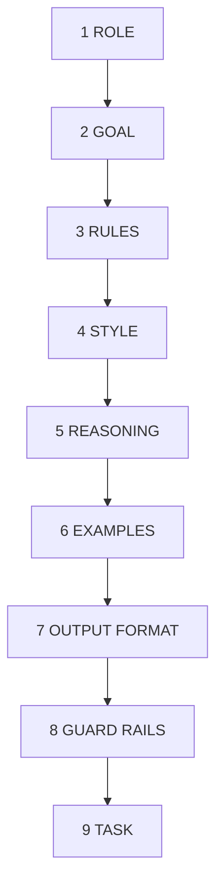
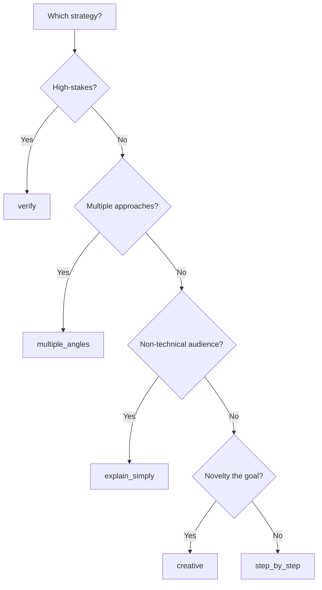

# Prompt Assembly & Thinking Strategies

When you call `ctx.assemble()`, mycontext-ai builds a structured prompt from your Context fields. Understanding how that structure is ordered, how to target a specific provider, and how to inject a reasoning strategy is what separates a good prompt from a great one.

---

## How a Context Assembles

A Context assembles into nine ordered sections. Each section maps directly to a field you set on the Context or its sub-objects.

The complete field-to-section mapping:

| Section | Source field | Notes |
|---------|-------------|-------|
| ① ROLE | `Guidance.role` + `persona_scope` | Identity and domain boundary |
| ② GOAL | `Guidance.goal` | Rendered as "Your mission: X — accomplish this fully." |
| ③ RULES | `Guidance.rules` | Numbered list, hard → easy ordering |
| ④ STYLE | `Constraints.style_guide` or `Guidance.style` | Tone and voice |
| ⑤ REASONING | `thinking_strategy` or `analytical_approach` | Cognitive strategy injection |
| ⑥ EXAMPLES | `examples` | Few-shot demonstrations |
| ⑦ OUTPUT FORMAT | `Constraints.output_contract` + `output_schema` | Explicit response shape |
| ⑧ GUARD RAILS | `Constraints.must_include/must_not_include/format_rules` | Hard constraints |
| ⑨ TASK | `Directive` | Always last — highest attention at generation time |



The ordering is deliberate. Instructions that land at the start and end of a prompt are recalled most reliably. The task always arrives last so the LLM's attention is at its peak when it reads what it needs to actually do. Reasoning strategies sit just before the examples so they calibrate the model before it sees the demonstrations. Guard rails land just before the task so they are freshest in context when the model begins generating.

If a section's field is not set, it is omitted entirely — the prompt only contains what you provide.

### Full Example

```python
from mycontext import Context, Guidance, Directive, Constraints

ctx = Context(
    guidance=Guidance(
        role="Senior sentiment analysis expert",
        goal="Classify product reviews with confidence scores and actionable recommendations",
        persona_scope="Limit analysis to the review text provided — do not infer product history or brand context.",
        rules=[
            "Always provide a confidence score between 0.0 and 1.0",
            "Consider context, sarcasm, and mixed sentiments",
            "Provide specific evidence from the text for every classification",
        ],
        style="Professional and analytical with clear reasoning",
    ),
    directive=Directive("Analyze this review: 'Great build quality but battery dies by noon'"),
    thinking_strategy="step_by_step",
    examples=[
        {
            "input": "This product is amazing, best purchase this year!",
            "output": "Positive — strong enthusiasm, superlative language, confidence: 0.95",
        },
        {
            "input": "Delivery was fast but the product broke after a week.",
            "output": "Mixed — positive on delivery, negative on durability, confidence: 0.80",
        },
    ],
    constraints=Constraints(
        output_contract="Return ONLY a JSON object matching the schema below. No prose, no markdown wrapper.",
        style_guide="Analytical, evidence-based. Every claim must reference specific text from the review.",
        must_include=["sentiment", "confidence", "reasoning"],
        output_schema=[
            {"name": "sentiment", "type": "str"},
            {"name": "confidence", "type": "float"},
            {"name": "reasoning", "type": "str"},
            {"name": "recommendation", "type": "str"},
        ],
    ),
    research_flow=True,
)

print(ctx.assemble())
```

Assembled output:

```
## ROLE

You are Senior sentiment analysis expert.
Scope: Limit analysis to the review text provided — do not infer product history or brand context.

## GOAL

**Your mission:** Classify product reviews with confidence scores and actionable recommendations — accomplish this fully.

## RULES

**You MUST follow these rules at all times:**
  1. Always provide a confidence score between 0.0 and 1.0
  2. Consider context, sarcasm, and mixed sentiments
  3. Provide specific evidence from the text for every classification

## STYLE

**Tone & voice:** Analytical, evidence-based. Every claim must reference specific text from the review.

## REASONING APPROACH (Chain of Thought)

**Important — Think through this step by step. Break the problem down into
stages, show your reasoning at each stage, then give your final answer.**

## EXAMPLES

Learn from these examples of expected input → output:

**Example 1:**
Input: This product is amazing, best purchase this year!
Output: Positive — strong enthusiasm, superlative language, confidence: 0.95

**Example 2:**
Input: Delivery was fast but the product broke after a week.
Output: Mixed — positive on delivery, negative on durability, confidence: 0.80

## OUTPUT FORMAT

Return ONLY a JSON object matching the schema below. No prose, no markdown wrapper.

**Return your response as a JSON object** with these required fields:

- **`sentiment`** (str)
- **`confidence`** (float)
- **`reasoning`** (str)
- **`recommendation`** (str)

## GUARD RAILS

**ALWAYS include the following:**
  - sentiment
  - confidence
  - reasoning

---

## YOUR TASK

Analyze this review: 'Great build quality but battery dies by noon'
```

---

## Provider-Aware Assembly

Set `provider_hint` on `Context` to adapt the assembled prompt to each provider's documented formatting preferences. The content stays identical — only the rendering layer changes.

```python
ctx = Context(
    guidance=Guidance(role="data analyst", goal="Find revenue anomalies"),
    constraints=Constraints(must_not_include=["speculation"]),
    research_flow=True,
    provider_hint="anthropic",   # or "openai", "gemini", "generic"
)
```

`provider_hint` is independent of `execute(provider=...)` — one controls how the prompt is *assembled*, the other controls which model *receives* it.

### What each hint does

| Override | `openai` | `anthropic` | `gemini` |
|----------|----------|-------------|---------|
| **Delimiters** | `## Markdown` headings | `<xml>` tags | `<xml>` tags |
| **Constraint phrasing** | `Must NOT include: X` | `Omit X.` (positive redirect) | `Omit X.` (positive redirect) |
| **Role traits** | Role title only | Role title only | Appends style as trait adjectives: `"You are precise, analytical."` |
| **Instruction mirror** | Repeats goal + top rules after long `knowledge` blocks | — | — |
| **Verbosity anchor** | — | — | Appends `"Be direct and efficient."` to task |

### Anthropic output

With `provider_hint="anthropic"`, every section wraps in XML tags — Anthropic's primary documented recommendation for structured prompts:

```
<role>
You are data analyst.
</role>

<goal>
**Your mission:** Find revenue anomalies — accomplish this fully.
</goal>

<guard_rails>
Exclude the following (use alternatives where needed):
  - Omit speculation.
</guard_rails>

---

<your_task>
Analyze the Q4 dataset.
</your_task>
```

### OpenAI output

With `provider_hint="openai"`, Markdown headings are used. For long `knowledge` blocks, goal and top rules are automatically mirrored at the end of the prompt to counteract the lost-in-the-middle effect:

```
## ROLE

You are data analyst.

## GOAL

**Your mission:** Find revenue anomalies — accomplish this fully.

## GUARD RAILS

Must NOT include:
  - speculation

---

## YOUR TASK

Analyze the Q4 dataset.

---

## KEY REMINDERS (re-stated after long context)

Reminder — your mission: Find revenue anomalies
```

### Gemini output

With `provider_hint="gemini"`, XML tags are used and style is injected as trait adjectives on the role. A verbosity anchor is appended to the task section:

```
<role>
You are data analyst. You are precise, analytical, direct.
</role>

<your_task>
Analyze the Q4 dataset.

Be direct and efficient. Avoid unnecessary preamble.
</your_task>
```

### Research basis

Provider-specific formatting was validated against official documentation from OpenAI (GPT-4.1 Prompting Guide), Anthropic (Claude prompt engineering docs), and Google (Gemini API prompting strategies). A 2026 benchmark across 600 model calls found format deltas of ≤0.3% between XML and Markdown on frontier models — the differences matter most for **constraint compliance** and **long-context recall**, not general accuracy.

See the research section for the full background on prompt ordering and architecture.

---

## Thinking Strategies

`thinking_strategy` injects a reasoning instruction into section ⑤ — positioned after style and before examples so the model understands *how to think* before it sees the demonstrations.

There are five strategies. Each encodes a distinct cognitive approach. Choosing the right one is as important as the prompt itself.

---

### `step_by_step` — Chain of Thought

**What it injects:**

> Think through this step by step. Break the problem down into stages, show your reasoning at each stage, then give your final answer.

**The cognitive model.** Chain of Thought forces the model to externalise its intermediate reasoning rather than jumping to a conclusion. When intermediate steps are visible, errors surface earlier and the model self-corrects before the final answer is produced. This technique consistently improves accuracy on problems that require multiple sequential decisions.

**When to use it.**

- The problem has multiple dependent steps where an early error propagates (debugging, root cause analysis, mathematical reasoning)
- You need to audit or explain the reasoning, not just the conclusion
- The task involves a procedure — steps that must happen in order
- You're working with complex data where synthesis happens across multiple facts

**Decision criteria:**

| Ask yourself | If yes → use `step_by_step` |
|---|---|
| Could someone solve this by working backwards from the answer? | No — the path matters |
| Are there intermediate calculations or judgments required? | Yes |
| Would a wrong early assumption corrupt the whole answer? | Yes |
| Do you need to show your work (audit, explanation, tutorial)? | Yes |

**Best for:** Root cause analysis, incident post-mortems, code debugging, data analysis, medical or legal reasoning, multi-step math, tutorial writing.

**Example:**

```python
from mycontext import Context, Guidance, Directive

ctx = Context(
    guidance=Guidance(
        role="Principal site reliability engineer",
        goal="Identify the root cause of the production outage and prevent recurrence",
        rules=[
            "Trace every causal chain to its origin — do not stop at symptoms",
            "Quantify the blast radius at each stage",
        ],
    ),
    directive=Directive(
        "Diagnose why API error rates spiked to 40% at 14:32 UTC. "
        "Available data: deployment at 14:28, DB CPU at 98%, 3 new pods OOMKilled."
    ),
    thinking_strategy="step_by_step",
    research_flow=True,
)
```

---

### `multiple_angles` — Tree of Thought

**What it injects:**

> Before answering, brainstorm at least 3 different approaches or perspectives. Briefly evaluate the strengths and weaknesses of each, then choose the best approach and explain why.

**The cognitive model.** Tree of Thought prevents premature commitment to the first solution the model generates — which is often the most obvious one, not the best one. By forcing evaluation of multiple branches before converging, the model surfaces trade-offs that a single-path response would miss. The explicit evaluation step also makes the reasoning legible: you can see *why* one option was chosen over another.

**When to use it.**

- The problem has multiple plausible solutions with genuine trade-offs (no single correct answer)
- You need to justify a decision to stakeholders who will question the alternatives
- Design or architecture decisions where the right answer depends on constraints that aren't fully known
- Any situation where "it depends" is actually the honest answer, and you need to unpack what it depends on

**Decision criteria:**

| Ask yourself | If yes → use `multiple_angles` |
|---|---|
| Are there 2+ legitimate approaches, each with real downsides? | Yes |
| Will someone push back and ask "what about X instead?" | Yes |
| Does the right answer depend heavily on unstated constraints? | Yes |
| Is the goal to make a decision rather than execute a procedure? | Yes |

**Best for:** Architecture decisions, vendor selection, strategic planning, investment trade-offs, policy design, comparative analysis, recommendation reports.

**Example:**

```python
from mycontext import Context, Guidance, Directive

ctx = Context(
    guidance=Guidance(
        role="Staff software architect",
        goal="Recommend a caching strategy that the team can implement and maintain",
        rules=[
            "Evaluate each option against latency, cost, and operational complexity",
            "Be explicit about what assumptions each option requires",
        ],
        style="Structured, decision-oriented — lead with trade-offs",
    ),
    directive=Directive(
        "Recommend a caching strategy for a read-heavy API that serves 50k RPM. "
        "Current stack: Python FastAPI, PostgreSQL, deployed on Kubernetes."
    ),
    thinking_strategy="multiple_angles",
    research_flow=True,
)
```

---

### `verify` — Self-Reflection

**What it injects:**

> After providing your answer, critically review it. Check for errors, missing information, unsupported claims, or logical gaps. If you find issues, revise your answer.

**The cognitive model.** Self-Reflection adds a second cognitive pass: the model acts as both author and critic. The first pass produces an answer; the second pass audits it against the original requirements. This structure catches a class of errors that pure Chain of Thought misses — cases where the reasoning was internally consistent but the conclusion was still wrong or incomplete. It is especially effective at catching hallucinations, overclaiming, and missing edge cases.

**When to use it.**

- The cost of an error is high (legal, medical, financial, security)
- The output will be acted on directly without further human review
- The task involves factual claims that could be confidently stated but wrong
- Compliance or contractual requirements demand documented evidence for every claim

**Decision criteria:**

| Ask yourself | If yes → use `verify` |
|---|---|
| Would a wrong answer cause real harm or significant rework? | Yes |
| Is the model likely to generate plausible-sounding but incorrect details? | Yes |
| Does the output need to be defensible or auditable? | Yes |
| Is completeness a hard requirement (every clause, every risk)? | Yes |

**Best for:** Security audits, compliance reviews, contract analysis, medical content, financial models, any output that gets published or acted on without further review.

**Example:**

```python
from mycontext import Context, Guidance, Directive, Constraints

ctx = Context(
    guidance=Guidance(
        role="Senior information security engineer",
        goal="Produce a complete and accurate security assessment — no gaps or overclaiming",
        rules=[
            "Every vulnerability must be backed by a specific code location or configuration",
            "Do not flag theoretical risks without evidence in the provided code",
        ],
    ),
    directive=Directive(
        "Audit this authentication service for OWASP Top 10 vulnerabilities: ..."
    ),
    constraints=Constraints(
        must_include=["CVE or OWASP reference", "severity", "remediation steps"],
        must_not_include=["speculative risks without code evidence"],
    ),
    thinking_strategy="verify",
    research_flow=True,
)
```

---

### `explain_simply` — Simplification

**What it injects:**

> Explain your reasoning in simple, everyday language that anyone can understand. Avoid jargon and technical terms. Use analogies where helpful.

**The cognitive model.** Simplification does not mean dumbing down — it means calibrating the output to the audience's existing mental model. The model is constrained to find analogies and plain-language explanations, which forces it to genuinely understand the concept rather than recite technical definitions. The requirement to use analogies is particularly powerful: a good analogy proves comprehension in a way that a technical summary does not.

**When to use it.**

- The audience is non-technical or unfamiliar with the domain (executives, patients, end-users)
- The output is a first explanation of a complex concept, not a reference document
- You are writing user-facing documentation, onboarding material, or support content
- The goal is persuasion or adoption, not precision — precision can alienate

**Decision criteria:**

| Ask yourself | If yes → use `explain_simply` |
|---|---|
| Does the audience lack domain vocabulary? | Yes |
| Is the primary goal understanding, not accuracy to 4 decimal places? | Yes |
| Will jargon cause the reader to disengage or misinterpret? | Yes |
| Is this being read once by a non-expert rather than referenced by a specialist? | Yes |

**Best for:** Executive summaries, patient-facing health content, product onboarding, user documentation, press releases, public policy communication, teaching materials.

**Example:**

```python
from mycontext import Context, Guidance, Directive

ctx = Context(
    guidance=Guidance(
        role="Technical writer specialising in developer onboarding",
        goal="Make a new engineer feel confident and ready, not overwhelmed",
        rules=[
            "No acronyms without explanation on first use",
            "Every concept gets a real-world analogy",
            "Lead with why it matters before explaining how it works",
        ],
        style="Warm, encouraging, conversational",
    ),
    directive=Directive(
        "Explain how our event-driven microservices architecture works "
        "to a new backend engineer on their first week."
    ),
    thinking_strategy="explain_simply",
    research_flow=True,
)
```

---

### `creative` — Divergent Thinking

**What it injects:**

> Explore unconventional, surprising, and creative ideas. Don't limit yourself to the obvious answer. Challenge assumptions and consider perspectives that others might miss.

**The cognitive model.** Divergent Thinking explicitly deactivates the model's tendency toward the most probable, most conventional response. LLMs are trained on human-produced text where conventional ideas dominate by volume — the "average" response is always in reach. The `creative` strategy instructs the model to move away from that attractor and surface low-probability, high-originality outputs. The instruction to "challenge assumptions" is specifically designed to break frames, not just generate variations within them.

**When to use it.**

- The goal is ideation, not execution — you want options, not a single answer
- The domain is mature and conventional approaches are already known and insufficient
- You need to break a frame or reframe a problem, not solve the current formulation
- Creative, marketing, or naming tasks where "the obvious answer" is also the forgettable one

**Decision criteria:**

| Ask yourself | If yes → use `creative` |
|---|---|
| Have the conventional approaches already been tried? | Yes |
| Is novelty itself a success criterion? | Yes |
| Are you generating options to evaluate, not a final deliverable? | Yes |
| Would a surprising answer be more valuable than a safe one? | Yes |

**Best for:** Product ideation, naming, marketing campaigns, strategic reframing, research hypothesis generation, UX innovation, writing prompts, competitive differentiation.

**Example:**

```python
from mycontext import Context, Guidance, Directive

ctx = Context(
    guidance=Guidance(
        role="Product strategist with a background in behavioral economics",
        goal="Generate product positioning angles that stand out in a crowded market",
        rules=[
            "Every idea must challenge at least one industry assumption",
            "Prioritise angles that competitors would be unlikely to copy",
        ],
        style="Bold, direct, no filler — quality over quantity",
    ),
    directive=Directive(
        "Generate 5 unconventional positioning angles for a developer productivity SDK "
        "in a market where every competitor leads with 'save time' messaging."
    ),
    thinking_strategy="creative",
    research_flow=True,
)
```

---

## Choosing a Strategy

If the task type is unclear, use this decision path:



You can also combine strategies conceptually — use `step_by_step` to work through a structured analysis, then add `must_include=["self-critique section"]` in Constraints to get the verification behaviour without a second strategy injection.

---

## Few-Shot Examples

The `examples` field provides input→output demonstrations that calibrate the model's format, tone, and reasoning style before it sees the actual task:

```python
ctx = Context(
    ...
    examples=[
        {
            "input": "This product is amazing, best purchase this year!",
            "output": "Positive — strong enthusiasm, confidence: 0.95",
        },
        {
            "input": "Delivery was fast but the product broke after a week.",
            "output": "Mixed — positive on delivery, negative on durability, confidence: 0.80",
        },
    ],
    research_flow=True,
)
```

Examples are placed in section ⑥ — after reasoning strategy, before output format and guard rails — which is where they have the strongest calibration effect. Use 2–4 examples. More than 5 rarely adds value and inflates token count.

---

## Generate a Full Context from Role + Goal

If you don't want to populate every field manually, `generate_context` takes a role and goal and uses an LLM to fill in everything else — rules, style, expertise, thinking strategy, examples, output schema, and guard rails.

```python
from mycontext.intelligence import generate_context

result = generate_context(
    role="Senior fraud analyst at a tier-1 investment bank",
    goal="Detect suspicious transaction patterns with a low false-positive rate",
    task="Analyze this batch of 50 transactions for fraud signals",
    provider="openai",
)

# See what was generated
print(result.generation_meta)
# {
#   "rules": [...],
#   "style": "...",
#   "expertise": [...],
#   "thinking_strategy": "step_by_step",
#   "examples": [...],
#   "output_schema": [...],
#   "must_include": [...]
# }

# The result is a fully-populated Context(research_flow=True)
print(result.assemble())

# Execute directly
response = result.execute(provider="openai")
```

The `generation_meta` field contains the raw spec the LLM produced. Inspect it to understand what was generated, then either use the context as-is or pull the `Context` out with `result.to_context()` and modify specific fields.

---

**See also:** [Context Object →](./context-object) | [Guidance →](./guidance) | [Constraints →](./constraints) | [API Reference →](../api/overview)
