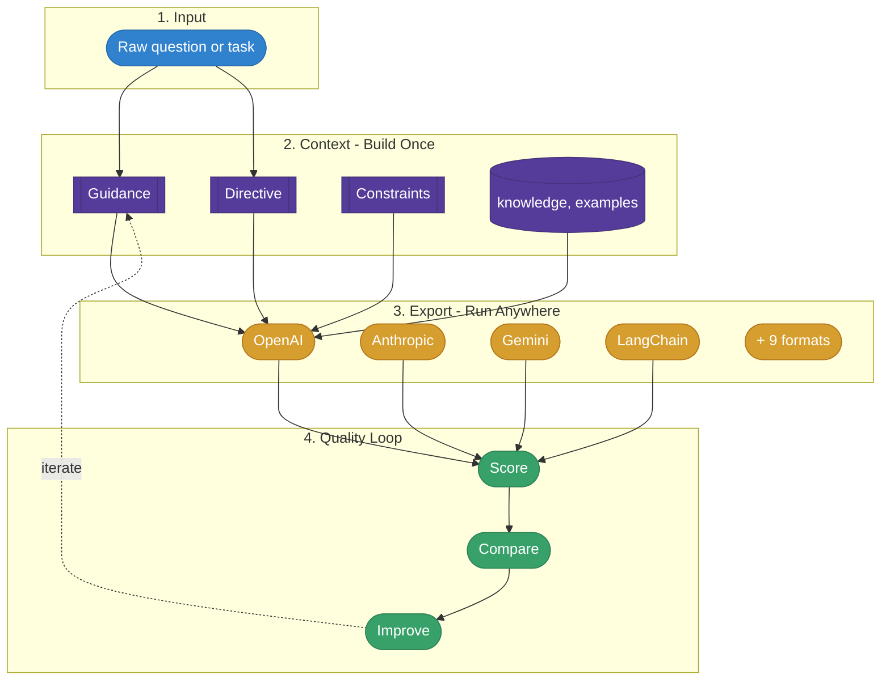
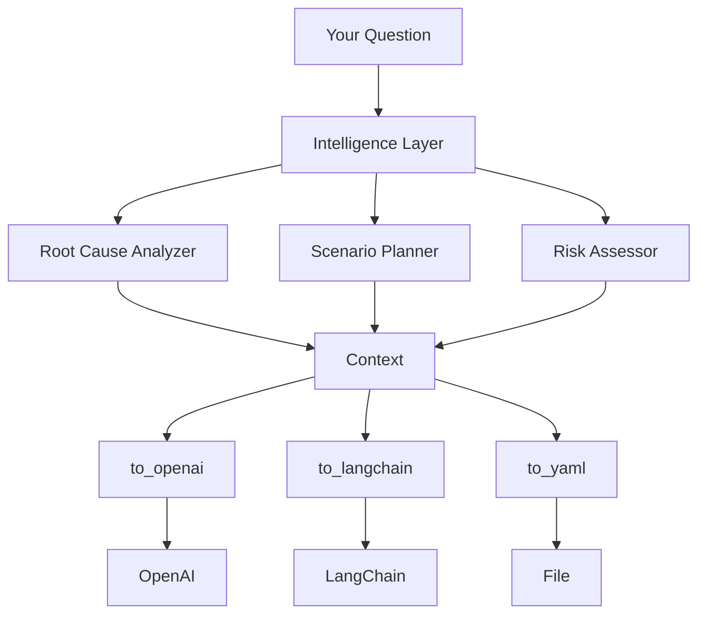

# Core Concepts

mycontext-ai is built on a simple principle: **separate what the AI should know from what it should do from what it must not do.** This page explains the key abstractions and how they fit together.

## Architecture Overview



## Context

The `Context` is the central object. It holds everything an LLM needs to produce a high-quality response.

```python
from mycontext import Context, Guidance, Directive, Constraints

ctx = Context(
    guidance=Guidance(role="Data analyst", style="precise, evidence-based"),
    directive=Directive(content="Analyze Q3 revenue trends and identify anomalies."),
    constraints=Constraints(must_include=["data sources"], format_rules=["Use tables"]),
    knowledge="Q3 revenue data: ...",
)
```

A Context is **provider-agnostic**. You build it once and export to any LLM format:

```python
ctx.to_openai()       # → OpenAI messages
ctx.to_anthropic()    # → Claude format
ctx.to_langchain()    # → LangChain messages
ctx.to_yaml()         # → Portable YAML config
```

[Full Context reference →](../foundations/context-object)

## Guidance

**Guidance** defines *who* the AI should be and *what it is optimising for* — its role, objective, expertise, behavioral rules, and communication style.

```python
from mycontext.foundation import Guidance

guidance = Guidance(
    role="Senior Python developer with 15 years of experience",
    goal="Produce production-ready code with clear reasoning behind every decision",
    rules=[
        "Always consider edge cases",
        "Prefer readability over cleverness",
        "Cite PEP standards when relevant",
    ],
    style="technical but approachable",
    expertise=["Python", "API design", "testing"],
)
```

| Field | Purpose | Example |
|-------|---------|---------|
| `role` | The persona the LLM adopts | "Senior security engineer" |
| `goal` | The objective — what success looks like | "Find all exploitable vulnerabilities" |
| `rules` | Behavioral constraints as a list | ["Never suggest deprecated APIs"] |
| `style` | Communication tone | "concise, actionable" |
| `expertise` | Domain knowledge areas | ["Python", "AWS", "security"] |

[Full Guidance reference →](../foundations/guidance)

## Directive

**Directive** defines *what* the AI should do — the specific task, its priority, and any tags for organization.

```python
from mycontext.foundation import Directive

directive = Directive(
    content="Review the authentication middleware for SQL injection and XSS vulnerabilities.",
    priority="high",
    constraints="Focus on user-facing endpoints only.",
    tags=["security", "code-review"],
)
```

| Field | Purpose | Example |
|-------|---------|---------|
| `content` | The task instruction | "Analyze this data and..." |
| `priority` | Importance level | "high", "medium", "low" |
| `constraints` | Task-specific limits | "Focus on the last 30 days" |
| `tags` | Categorization | ["analysis", "finance"] |

[Full Directive reference →](../foundations/directive)

## Constraints

**Constraints** define *what the AI must not do* — hard boundaries, format requirements, and guardrails.

```python
from mycontext.foundation import Constraints

constraints = Constraints(
    must_include=["severity rating", "remediation steps"],
    must_not_include=["generic disclaimers", "off-topic commentary"],
    format_rules=["Use markdown tables", "Include code examples"],
    max_length=2000,
    language="en",
)
```

| Field | Purpose | Example |
|-------|---------|---------|
| `must_include` | Required elements in the response | ["executive summary"] |
| `must_not_include` | Forbidden content | ["speculation"] |
| `format_rules` | Output formatting requirements | ["Use bullet points"] |
| `max_length` | Maximum response length | 2000 |
| `language` | Response language | "en" |

[Full Constraints reference →](../foundations/constraints)

## Prompt Assembly & Thinking Strategies

When `assemble()` is called, the Context renders into a nine-section structured prompt. Each section maps to a specific field, and each is positioned deliberately — the task always arrives last so the LLM's attention is at its peak when it reads what it needs to do.

```python
ctx = Context(
    guidance=Guidance(
        role="Sentiment analyst",
        goal="Classify reviews with confidence scores",
        rules=["Always cite evidence from the text"],
    ),
    directive=Directive("Analyze: 'Great build, terrible battery life'"),
    thinking_strategy="step_by_step",
    examples=[
        {"input": "Broke after a week.", "output": "Negative — confidence: 0.88"},
    ],
    research_flow=True,
)
```

`thinking_strategy` injects a named reasoning approach into section ⑤ of the assembled prompt. Five strategies are available:

| Field | Purpose |
|-------|---------|
| `research_flow` | Enables the nine-section structured assembly |
| `thinking_strategy` | Injects a reasoning approach: `step_by_step`, `multiple_angles`, `verify`, `explain_simply`, `creative` |
| `examples` | Few-shot input→output pairs, placed in section ⑥ after the reasoning strategy |

[Full assembly and strategy reference →](../foundations/research-flow)

## Patterns

**Patterns** are reusable context templates that implement specific cognitive frameworks. Instead of writing a prompt from scratch, you use a pattern that encodes proven methodology.

```python
from mycontext.templates.free.reasoning import RootCauseAnalyzer

# A Pattern has a build_context() method with typed inputs
ctx = RootCauseAnalyzer().build_context(
    problem="Server crashes during peak hours",
    depth="comprehensive",
)

# The returned Context contains Five Whys + Ishikawa methodology
print(ctx.guidance.role)  # "Root cause analysis expert..."
```

Every pattern provides:
- **`build_context(**inputs)`** — builds a full `Context` with the pattern's methodology
- **`execute(provider, **inputs)`** — build + execute in one call
- **`generic_prompt(**inputs)`** — a zero-cost prompt that distills the methodology into ~600-1200 chars

There are **85 patterns** (16 free + 69 enterprise) across analysis, reasoning, creative thinking, communication, planning, decision-making, systems thinking, metacognition, and more.

[Browse all patterns →](../cognitive-patterns/overview)

## Intelligence Layer

The **Intelligence Layer** sits on top of patterns and automates everything: pattern selection, context building, quality assessment, and execution.

```python
from mycontext.intelligence import smart_execute, suggest_patterns, transform

# Auto-select pattern + execute
response, meta = smart_execute("Why did churn spike 40%?", provider="openai")

# Just get pattern suggestions
result = suggest_patterns("Why did churn spike 40%?", mode="hybrid")

# Auto-transform any question into a Context
ctx = transform("Compare microservices vs monolith architectures.")
```

Key intelligence capabilities:

| Function | What it does |
|----------|-------------|
| `smart_execute()` | One-call: select pattern → build → execute |
| `suggest_patterns()` | Recommend patterns for a question |
| `transform()` | Convert any question into a structured Context |
| `smart_prompt()` | Compile a reusable prompt artifact |
| `smart_generic_prompt()` | Zero-cost prompt compilation |
| `build_workflow_chain()` | Auto-build multi-step reasoning chains |

[Explore the intelligence layer →](../intelligence/overview)

## Quality & Measurement

mycontext-ai doesn't just build contexts — it **measures** them.

| Tool | What it measures |
|------|-----------------|
| **QualityMetrics** | Context quality on 6 dimensions (clarity, completeness, specificity, relevance, structure, efficiency) |
| **OutputEvaluator** | LLM response quality on 5 dimensions (instruction following, reasoning depth, actionability, structure compliance, cognitive scaffolding) |
| **CAI** | Context Amplification Index — proves that a template produces better output than a raw prompt |

```python
from mycontext.intelligence import QualityMetrics

metrics = QualityMetrics()
score = metrics.evaluate(ctx)
# → Overall: 0.87 | Clarity: 0.92 | Completeness: 0.85 | ...
```

[Learn about quality metrics →](../quality/quality-metrics)

## How It All Fits Together



## Async & Token-Aware Execution

Two capabilities you'll reach for in production systems:

**Async execution** — `ctx.aexecute()` is a native coroutine. It never blocks, integrates directly into FastAPI and any `async` application, and enables true fan-out parallelism:

```python
results = await asyncio.gather(
    ctx_root_cause.aexecute(provider="openai"),
    ctx_risk.aexecute(provider="openai"),
    ctx_summary.aexecute(provider="anthropic"),
)
```

**Token-budget assembly** — `ctx.assemble_for_model()` builds a prompt guaranteed to fit within a model's context window. Sections are trimmed by priority if the budget is tight — the role and directive are always preserved:

```python
# Fits precisely into gpt-4o-mini's window, trimming lower-priority sections if needed
prompt = ctx.assemble_for_model(model="gpt-4o-mini")

# Reserve space for response tokens in agentic loops
prompt = ctx.assemble_for_model(model="gpt-4o", max_tokens=4000)
```

[Full async guide →](../intelligence/async-execution) · [Token-budget guide →](../intelligence/token-budget)

---

**Next:** Deep dive into each building block:
- [Context Object](../foundations/context-object)
- [Guidance](../foundations/guidance)
- [Directive](../foundations/directive)
- [Constraints](../foundations/constraints)
- [Prompt Assembly & Thinking Strategies](../foundations/research-flow)
- [Patterns](../foundations/patterns)
- [Security, Reliability & Performance](../advanced/reliability)
