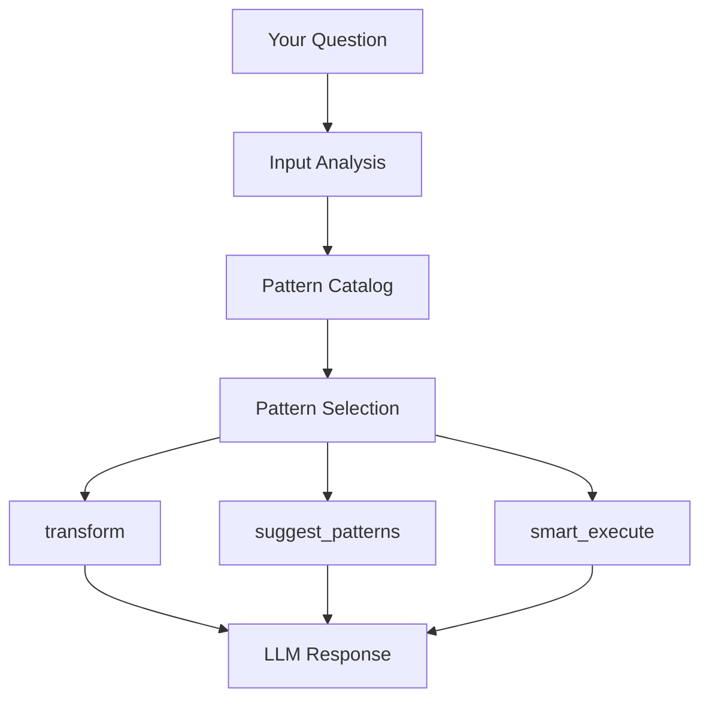

# Intelligence Layer

The Intelligence Layer sits above the core Context/Pattern API and adds automatic reasoning — it analyzes your question, selects the right cognitive patterns, composes multi-pattern prompts, and orchestrates complex workflows.

```python
from mycontext.intelligence import (
    transform,                  # Auto pattern selection → Context
    suggest_patterns,           # Recommend patterns for a question
    suggest_routes,             # Multi-route agent pipelines (v0.10+)
    smart_execute,              # Auto-route + execute in one call
    smart_prompt,               # Auto-route + compose optimized prompt
    smart_generic_prompt,       # Zero-cost auto-route + compile
    build_workflow_chain,       # Deprecated — prefer suggest_routes
    TemplateIntegratorAgent,    # Fuse multiple templates into one
    PromptComposer,             # Merge template prompts
    QualityMetrics,             # Measure context quality
    ContextAmplificationIndex,  # CAI quality signal
    PromptArchitect,            # Parse → score → rewrite any raw prompt
    classify_generation_intent,  # Heuristic task class for decoding presets
    model_allows_sampling,     # Whether model id supports temperature/top_p
    resolve_generation_kwargs, # Map task + model → LiteLLM kwargs (+ rationale)
    GuidanceOptimizer,          # Upgrade Guidance rules to binding language
    get_criteria,               # Pre-built DeepEval GEval criteria bundles
)
```

## The Core Intelligence Functions

| Function | What it does | LLM calls |
|----------|-------------|-----------|
| [`transform()`](./transform) | Analyze input → auto-select pattern → return Context | 0 |
| [`suggest_patterns()`](./pattern-suggestion) | Suggest best patterns + chain order | 0 (keyword) or 1 (hybrid/llm) |
| [`suggest_routes()`](./route-suggestion) | Multiple differentiated routes + agent steps (`receives` / `produces`) | 1 |
| [`smart_execute()`](./smart-execute) | Route → execute → return response | 2 (assess + execute) |
| [`smart_prompt()`](./smart-execute) | Route → compose optimized prompt | 2–4 |
| [`smart_generic_prompt()`](./smart-execute) | Route → compile generic prompt | 1 (assess only) |
| [`build_workflow_chain()`](./chain-orchestration) | **Deprecated** — single-chain workflow result | 1+ (may delegate to `suggest_routes`) |
| [`generate_context()`](./prompt-compilation) | LLM generates a full Context from role + goal | 1 |

## Architecture Overview



## Three Complexity Tiers

`smart_execute()` and `smart_prompt()` automatically route questions into three tiers:

### Tier 1: Raw
Simple, well-known questions answered directly. No templates needed.
```
"What is Python?" → Raw LLM call
```

### Tier 2: Single Template
Specialized questions where one pattern adds clear value.
```
"Review this code for security issues" → CodeReviewer template
```

### Tier 3: Integrated
Multi-domain, complex questions requiring multiple frameworks fused together.
```
"Should we migrate to microservices given our 10-year-old monolith?" 
→ DecisionFramework + RiskAssessor + TechnicalTranslator (integrated)
```

## Quick Start

```python
from mycontext.intelligence import smart_execute, suggest_patterns, transform

# Option 1: Let it figure everything out (2 LLM calls)
response, meta = smart_execute(
    "Why did our conversion rate drop 30% after the latest release?",
    provider="openai",
)
print(response)
print(f"Mode: {meta['mode']}, Templates: {meta['templates_used']}")

# Option 2: See recommendations first (0 LLM calls)
result = suggest_patterns(
    "Why did our conversion rate drop 30%?",
    mode="keyword",
)
print(result.suggested_chain)
# → ['root_cause_analyzer', 'data_analyzer']
print(result.to_markdown())

# Option 3: Transform to Context (0 LLM calls)
ctx = transform("Why did our conversion rate drop 30%?")
print(ctx.metadata["transformation_metadata"]["patterns_applied"])
# → ['root_cause_analyzer']
result = ctx.execute(provider="openai")
```

## All Exports

```python
from mycontext.intelligence import (
    # Core functions
    transform,
    suggest_patterns,
    suggest_routes,
    smart_execute,
    smart_prompt,
    smart_generic_prompt,
    build_workflow_chain,

    # Route types (suggest_routes)
    RouteAnalysis,
    AnalysisRoute,
    RouteStep,

    # Classes
    TransformationEngine,
    TemplateIntegratorAgent,
    PromptComposer,
    QualityMetrics,
    ContextAmplificationIndex,
    OutputEvaluator,
    TemplateBenchmark,

    # Data classes
    InputAnalysis,
    SuggestionResult,
    PatternSuggestion,
    WorkflowChainResult,
    IntegrationResult,
    ComposedPrompt,
    QualityScore,
    CAIResult,
    ComplexityResult,

    # Enums
    InputType,
    ComplexityLevel,
    QualityDimension,

    # Utilities
    get_pattern_class,
    get_generic_prompt_for,
    assess_complexity,
    PATTERN_BUILD_CONTEXT_REGISTRY,
    FULL_PATTERN_CATALOG,
    VALID_PATTERN_NAMES,
)
```

## Prompt Quality Tools

These tools live in the Intelligence Layer and focus on improving the quality of prompts and template rules — before execution, not just after.

| Tool | Input | What it does | LLM call |
|------|-------|-------------|----------|
| [`PromptArchitect`](./prompt-architect) | Any raw prompt string | Parse sections → score → rewrite weak/missing → diff | 0 (parse) or 1 (build/improve) |
| [`GuidanceOptimizer`](./guidance-optimizer) | A `Guidance` object | Audit rules for suggestive modals + vague directives → rewrite only weak ones | 0 (audit) or 1 (optimize) |
| `QualityMetrics` | Any `Context` | Score on 6 dimensions: clarity, completeness, specificity, relevance, structure, efficiency | 0 |
| `OutputEvaluator` | LLM output + `Context` | Score on 5 dimensions: instruction_following, reasoning_depth, actionability, structure_compliance, cognitive_scaffolding | 0 |
| `get_criteria()` | Bundle name | Return pre-built DeepEval GEval rubrics | 0 |

## Choosing the Right Entry Point

| Your situation | Use |
|---------------|-----|
| I want to just get an answer | `smart_execute()` |
| I want to see what patterns are recommended | `suggest_patterns()` |
| I want a prompt string (not execution) | `smart_prompt()` or `smart_generic_prompt()` |
| I want to control which pattern runs | `pattern.execute()` directly |
| I want multiple analytical angles / agent pipelines | `suggest_routes()` |
| I want a legacy single-chain plan | `build_workflow_chain()` (deprecated) |
| I want to merge multiple templates | `TemplateIntegratorAgent` |
| I have a raw prompt and want it upgraded | `PromptArchitect.improve()` |
| I want to audit/rewrite template rules | `GuidanceOptimizer.optimize()` |
| I want to measure prompt quality | `QualityMetrics.evaluate()` |
| I want to measure output quality | `OutputEvaluator.evaluate()` |
| I want to measure amplification | `ContextAmplificationIndex.compute()` |

## Next Steps

- [transform() →](./transform) — Auto-select pattern + return Context
- [suggest_patterns() →](./pattern-suggestion) — Pattern recommendations
- [suggest_routes() →](./route-suggestion) — Multi-route agent planning
- [smart_execute() →](./smart-execute) — All-in-one execution
- [Prompt Compilation →](./prompt-compilation) — PromptComposer
- [Chain Orchestration →](./chain-orchestration) — `build_workflow_chain` (deprecated)
- [Template Integrator →](./template-integrator) — Fuse multiple templates
- [Async Execution →](./async-execution) — `aexecute`, concurrent patterns, FastAPI
- [Token-Budget Assembly →](./token-budget) — `assemble_for_model`, accurate trimming
- [PromptArchitect →](./prompt-architect) — Upgrade any raw prompt to the 9-section architecture
- [GuidanceOptimizer →](./guidance-optimizer) — Audit and rewrite weak template rules
