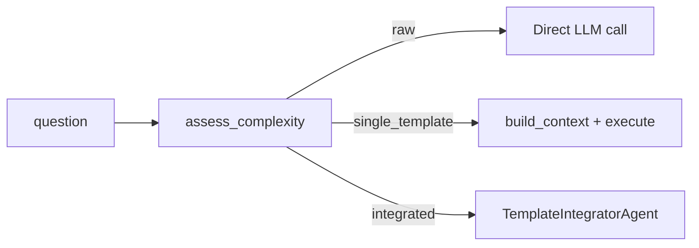

# smart_execute / smart_prompt

Three one-liner functions that handle the entire intelligence pipeline — from question to answer, automatically:

| Function | What you get | LLM calls |
|----------|-------------|-----------|
| `smart_execute()` | The final response (string) | 2 (assess + execute) |
| `smart_prompt()` | An optimized `ComposedPrompt` | 2–4 |
| `smart_generic_prompt()` | A zero-cost `ComposedPrompt` | 1 (assess only) |

## smart_execute()

The simplest entry point: ask a question, get an answer. The SDK figures out everything else.

```python
from mycontext.intelligence import smart_execute

response, meta = smart_execute(
    "Why did our customer churn spike 40% in Q3?",
    provider="openai",
)
print(response)
print(f"Mode: {meta['mode']}")            # "integrated"
print(f"Templates: {meta['templates_used']}")  # ['root_cause_analyzer', 'data_analyzer']
```

### Function Signature

```python
smart_execute(
    question: str,
    provider: str = "openai",
    include_enterprise: bool = True,
    model: str | None = None,
    **kwargs,
) -> tuple[str, dict]
```

**Returns:** `(response_text, execution_metadata)`

**Parameters:**

| Parameter | Type | Default | Description |
|-----------|------|---------|-------------|
| `question` | `str` | required | Question or problem |
| `provider` | `str` | `"openai"` | LLM provider |
| `include_enterprise` | `bool` | `True` | Include enterprise patterns |
| `model` | `str \| None` | `None` | Override model (e.g. `"gpt-4o"`) |
| `**kwargs` | | | Extra provider params (temperature, max_tokens, etc.) |

### Execution Metadata

The second return value is a metadata dict:

```python
response, meta = smart_execute("Why did revenue drop?", provider="openai")

meta["mode"]             # "raw" | "single_template" | "integrated"
meta["assessment"]       # Full ComplexityResult.to_dict()
meta["templates_used"]   # List of template names actually used
```

### The Three Execution Paths



### Examples

```python
# Simple question → raw execution
response, meta = smart_execute("What is GDPR?", provider="openai")
print(meta["mode"])           # "raw"
print(meta["templates_used"]) # []

# Specialized → single template
response, meta = smart_execute(
    "Review this Python auth code for SQL injection vulnerabilities",
    provider="openai",
)
print(meta["mode"])           # "single_template"
print(meta["templates_used"]) # ["code_reviewer"]

# Complex multi-domain → integrated
response, meta = smart_execute(
    "Should we migrate our monolith to microservices? We have 10 engineers, 5M users, and $2M runway.",
    provider="openai",
    model="gpt-4o",
)
print(meta["mode"])           # "integrated"
print(meta["templates_used"]) # ["decision_framework", "risk_assessor", "tradeoff_analyzer"]
```

---

## smart_prompt()

Like `smart_execute()` but returns the optimized prompt instead of the final response. Useful when you want to:
- Inspect the composed prompt
- Execute it yourself with a different provider
- Cache it for reuse
- Export as a string for use in another system

```python
from mycontext.intelligence import smart_prompt

composed = smart_prompt(
    "Why did our churn spike 40%?",
    provider="openai",
    refine=True,
)

# Get the optimized prompt string
print(composed.to_string())

# Execute it
response = composed.execute(provider="openai")

# Export as messages
messages = composed.to_messages()

# See which templates contributed
print(composed.source_templates)  # ['root_cause_analyzer', 'data_analyzer']
```

### Function Signature

```python
smart_prompt(
    question: str,
    provider: str = "openai",
    include_enterprise: bool = True,
    model: str | None = None,
    refine: bool = True,
    **kwargs,
) -> ComposedPrompt
```

**Parameters:**

| Parameter | Type | Default | Description |
|-----------|------|---------|-------------|
| `question` | `str` | required | Question or problem |
| `provider` | `str` | `"openai"` | LLM provider for composition |
| `include_enterprise` | `bool` | `True` | Include enterprise patterns |
| `model` | `str \| None` | `None` | Override model |
| `refine` | `bool` | `True` | Whether to LLM-refine each template prompt before composing |

**Returns:** `ComposedPrompt`

### `ComposedPrompt` Object

```python
@dataclass
class ComposedPrompt:
    prompt: str                    # The final composed prompt
    source_templates: list[str]    # Templates that contributed
    question: str                  # Original question
    component_prompts: list[str]   # Individual template prompts
    metadata: dict                 # Mode, assessment, etc.
    
    def execute(self, provider, **kwargs) -> str     # Execute → response
    def to_context(self) -> Context                  # Convert to Context
    def to_string(self) -> str                       # Get prompt as string
    def to_messages(self) -> list                    # OpenAI message format
    def to_dict(self) -> dict                        # Serialize
```

### Example: Inspect and Execute

```python
composed = smart_prompt("Should we expand to Europe or Asia first?")

# Inspect
print(f"Templates used: {composed.source_templates}")
print(f"Mode: {composed.metadata['mode']}")
print(f"Prompt length: {len(composed.to_string())} chars")

# Execute
answer = composed.execute(provider="anthropic", model="claude-3-5-sonnet-20241022")
print(answer)
```

---

## smart_generic_prompt()

The zero-cost version of `smart_prompt()`. Uses pre-authored generic prompts instead of LLM-refined ones — only one LLM call for the complexity assessment itself, then pure string compilation.

```python
from mycontext.intelligence import smart_generic_prompt

composed = smart_generic_prompt(
    "Why is our deployment failing every Friday?",
    provider="openai",
)

# The composed prompt uses generic prompts — no extra LLM calls
print(composed.metadata["mode"])    # "generic_compiled" or "raw"
print(composed.metadata["assessment"]["complexity"])  # "medium"

# Execute with a single LLM call
response = composed.execute(provider="openai")
```

### Function Signature

```python
smart_generic_prompt(
    question: str,
    provider: str = "openai",
    include_enterprise: bool = True,
    model: str | None = None,
    **kwargs,
) -> ComposedPrompt
```

### Cost Comparison

| Function | LLM calls for compilation | Quality |
|----------|--------------------------|---------|
| `smart_execute()` | 2–4 | Highest |
| `smart_prompt(refine=True)` | 2–4 | Very high |
| `smart_prompt(refine=False)` | 2 | High |
| `smart_generic_prompt()` | 1 | ~95% of smart_prompt |

### When to Use `smart_generic_prompt()`

- High-volume applications (1000s of calls)
- Real-time requirements (latency matters)
- Cost-sensitive workflows
- Batch processing

```python
# Process many questions efficiently
questions = ["Why did X drop?", "How do we fix Y?", "Should we do Z?"]

for q in questions:
    composed = smart_generic_prompt(q, provider="openai")
    response = composed.execute(provider="openai")
    print(f"Q: {q}\nA: {response[:100]}\n")
```

---

## Choosing Between the Three

```python
# You want an answer immediately
response, meta = smart_execute("Your question here")

# You want to see and control the prompt
composed = smart_prompt("Your question here")
print(composed.to_string())   # inspect
response = composed.execute() # execute when ready

# You need low cost + good quality
composed = smart_generic_prompt("Your question here")
response = composed.execute()
```

:::tip When NOT to use these functions
These functions call `assess_complexity()` first (1 LLM call) to decide the routing. For simple questions you already know will use a specific pattern, call the pattern directly — it's faster and cheaper.

```python
# ✓ Faster when you already know which pattern to use
from mycontext.templates.free.specialized import CodeReviewer
result = CodeReviewer().execute(provider="openai", code=my_code, language="Python")

# ✓ Use smart_execute for unknown/varied questions
response, meta = smart_execute(my_user_question, provider="openai")
```
:::

## API Reference

### `smart_execute()`

```python
def smart_execute(
    question: str,
    provider: str = "openai",
    include_enterprise: bool = True,
    model: str | None = None,
    **kwargs,
) -> tuple[str, dict]
```

### `smart_prompt()`

```python
def smart_prompt(
    question: str,
    provider: str = "openai",
    include_enterprise: bool = True,
    model: str | None = None,
    refine: bool = True,
    **kwargs,
) -> ComposedPrompt
```

### `smart_generic_prompt()`

```python
def smart_generic_prompt(
    question: str,
    provider: str = "openai",
    include_enterprise: bool = True,
    model: str | None = None,
    **kwargs,
) -> ComposedPrompt
```
