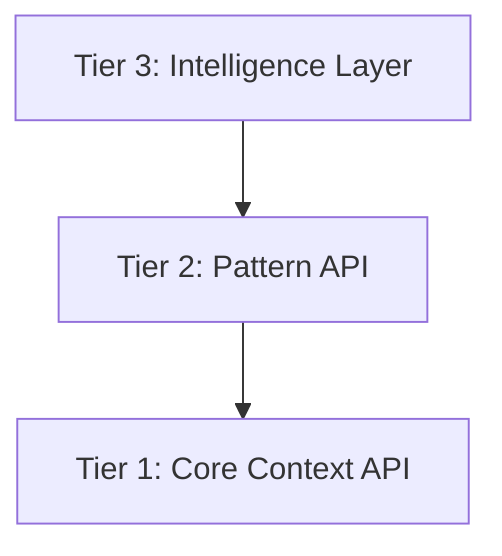
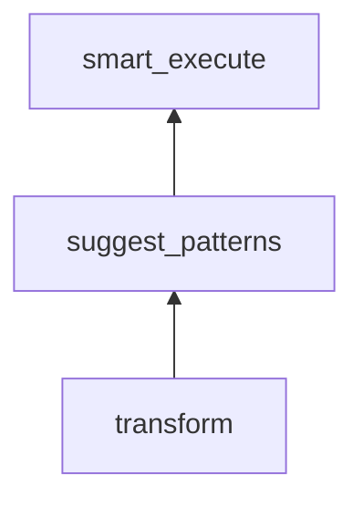
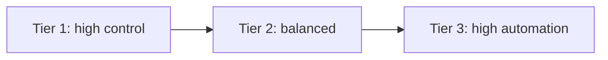

# Three-Tier Execution

mycontext supports three execution tiers. Each tier builds on the one below it:



## Tier 1: Core Context API

Direct construction of `Context` objects. Maximum control, zero magic.

```python
from mycontext import Context
from mycontext.foundation import Guidance, Directive, Constraints

code_to_review = "def login(u,p): query=f\"SELECT * FROM users WHERE u='{u}'\"; return db.execute(query)"
ctx = Context(
    guidance=Guidance(
        role="Senior security analyst specializing in authentication systems",
        rules=[
            "Identify vulnerabilities by severity (Critical → Low)",
            "Provide OWASP references for each finding",
            "Include concrete remediation steps, not just descriptions",
        ],
    ),
    directive=Directive(
        content="Review the following code for SQL injection risks: " + code_to_review,
        priority=9,
    ),
    constraints=Constraints(
        must_include=["SQL injection risk", "remediation example"],
        format_rules=["Group by severity", "OWASP reference per finding"],
    ),
)

result = ctx.execute(provider="openai")
print(result.response)
```

**Use Tier 1 when:**
- You need precise control over every part of the context
- You're building your own patterns or templates
- You have domain-specific knowledge to encode directly
- Prompt engineering for a production system

## Tier 2: Pattern API

Cognitive patterns provide pre-built, research-backed frameworks. You provide the content; the pattern provides the methodology.

```python
from mycontext.templates.free.specialized import CodeReviewer

# The pattern encodes: severity ranking, OWASP methodology,
# security + performance + maintainability review, output format
result = CodeReviewer().execute(
    provider="openai",
    code=my_code,
    language="Python",
    focus_areas=["security", "performance"],
)
print(result.response)
```

Or use the two-step version:

```python
# Step 1: Build the Context
ctx = CodeReviewer().build_context(
    code=my_code,
    language="Python",
    focus_areas=["security"],
)

# Inspect or modify before executing
print(ctx.guidance.role)  # "Senior code reviewer..."
print(len(ctx.directive.content))  # Full template directive

# Step 2: Execute
result = ctx.execute(provider="openai")
```

**Use Tier 2 when:**
- You know which analytical framework you need
- You want research-backed methodology without building it yourself
- You're building repeatable, consistent workflows
- Each call uses the same type of analysis

## Tier 3: Intelligence Layer

Automatic routing: analyze the input, select the best pattern(s), execute. Zero configuration.

### Sub-tiers within Tier 3



### `transform()` — Auto-select, no execute

```python
from mycontext.intelligence import transform

# Analyzes input → selects root_cause_analyzer → returns Context
ctx = transform("Why did our API latency spike after deployment?")

# You control execution
result = ctx.execute(provider="openai")
```

### `suggest_patterns()` — Recommendations only

```python
from mycontext.intelligence import suggest_patterns

result = suggest_patterns(
    "Why did our API latency spike?",
    mode="keyword",
)
print(result.suggested_chain)  # ['root_cause_analyzer', 'step_by_step_reasoner']
# You decide what to do next
```

### `smart_execute()` — Fully automatic

```python
from mycontext.intelligence import smart_execute

response, meta = smart_execute(
    "Why did our API latency spike?",
    provider="openai",
)
print(response)
print(meta["mode"])           # "single_template"
print(meta["templates_used"]) # ["root_cause_analyzer"]
```

**Use Tier 3 when:**
- You're processing user-generated or varied questions
- You don't know in advance which pattern is needed
- You're building AI assistants, chatbots, or Q&A systems
- You want the SDK to make pattern selection decisions

## Mixing Tiers

Tiers compose naturally. A common pattern: use Tier 3 to route, then Tier 2 to customize:

```python
from mycontext.intelligence import suggest_patterns
from mycontext.templates.free.reasoning import RootCauseAnalyzer

# Tier 3: recommend
result = suggest_patterns("Why did our churn increase?", mode="keyword")
top = result.suggested_patterns[0].name  # "root_cause_analyzer"

# Tier 2: execute with customization
if top == "root_cause_analyzer":
    response = RootCauseAnalyzer().execute(
        provider="openai",
        problem="Customer churn increased 40% in Q3",
        depth="comprehensive",  # customize depth
    )
```

Or: use Tier 3 for routing, Tier 1 for post-processing:

```python
from mycontext.intelligence import transform

# Tier 3: transform
ctx = transform("Should we rebuild our auth system?")

# Tier 1: modify before executing
ctx.constraints = Constraints(
    must_include=["cost estimate", "timeline", "risk rating"],
    format_rules=["Executive summary first"],
)
result = ctx.execute(provider="openai")
```

## Decision Guide

| Situation | Tier | Entry point |
|-----------|------|-------------|
| I'm building a specialized analyzer | 2 | `pattern.build_context()` |
| I need full prompt control | 1 | `Context()` directly |
| Processing user questions at runtime | 3 | `smart_execute()` |
| I want recommendations, not execution | 3 | `suggest_patterns()` |
| I want automation but execute myself | 3 | `transform()` |
| Multi-step analytical pipeline | 3 | `build_workflow_chain()` |
| Fusing multiple frameworks into one | 3 | `TemplateIntegratorAgent` |
| Composing prompts from templates | 3 | `PromptComposer` |

## Cost vs. Control Tradeoff



The right tier depends on your use case:
- **High variation in input** → Tier 3 (unknown questions, user inputs)
- **High repetition, known pattern** → Tier 2 (same analysis, different content)
- **Maximum precision needed** → Tier 1 (exact prompt engineering)
