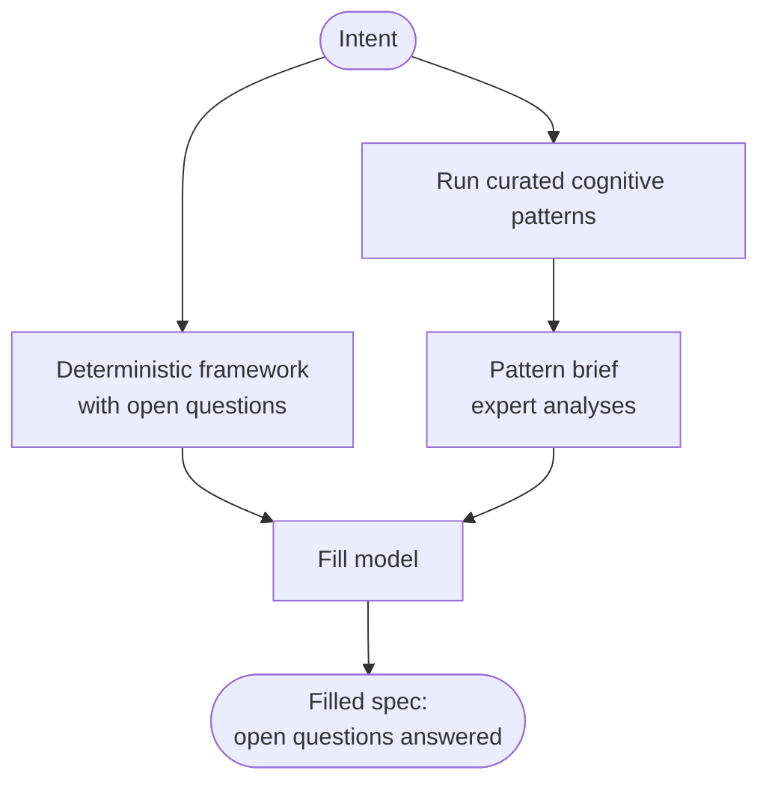

# Cognitive-Pattern Grounding & `execute=True`

By default, RaC is fully offline: it emits a complete framework with gaps marked
as open questions. When you opt into **`execute=True`** (or `--execute`), RaC uses
*your own* LLM key to **answer those open questions** and return a *filled* spec.

Crucially, this is **pattern-driven**: before answering, RaC runs a curated set
of [cognitive patterns](../cognitive-patterns/overview) over your intent and feeds
their analyses to the fill model as expert grounding. The result is answers
backed by real reasoning — a task decomposition, a rubric design, a pre-mortem,
an architecture trade-off study — not the fill model's unaided guess.

```python
from mycontext.rac import product, technical

# Offline draft (skeleton with open questions)
draft = product(INTENT)

# Filled spec — uses YOUR key, grounded in cognitive patterns
filled = product(INTENT, execute=True, provider="openai", model="gpt-4o-mini")
```

:::info Your key, your cost, your data
`execute=True` is the only part of RaC that contacts an LLM, and only through the
provider/key you configure (via LiteLLM). There is no mycontext server.
:::

## How the fill works



1. The deterministic framework is generated (same as offline).
2. A small, curated set of patterns runs over the intent.
3. Their analyses become an **expert brief**.
4. The fill model answers each `open_question`, grounded in that brief, and the
   answers are substituted back into the spec. Inline `TODO(OQ-n)` markers are
   replaced; answered questions get `status: answered`; `meta.status` becomes
   `filled` when no markers remain, and `meta.filled_by` records the model used.

The verbose analyses are **not** stored in the spec — only a clean
`meta.informed_by` provenance map (which patterns informed which sections).

### Which patterns run

| Spec | Section | Patterns |
|------|---------|----------|
| **product** | `tasks` | `problem_decomposer`, `gap_analyzer` |
| | `rubrics` | `rubric_designer` |
| | `safety` | `scenario_planner`, `root_cause_analyzer` |
| **technical** | `architecture` | `design_thinker`, `decision_framework` |
| | `guardrails` | `risk_mitigator` |
| | `security` | `ethical_framework_analyzer` |

The curated set is intentionally small (a few high-leverage sections) to bound
cost. It degrades gracefully: any pattern that errors is skipped.

### `meta.informed_by`

After `execute=True`, the spec carries a lightweight provenance map:

```yaml
meta:
  # ...
  informed_by:
    tasks: [problem_decomposer, gap_analyzer]
    rubrics: [rubric_designer]
    safety: [scenario_planner, root_cause_analyzer]
  filled_by: openai:gpt-4o-mini
  status: filled
```

## `analyze()` — read the grounding directly

The analyses behind `execute=True` are exposed so you can read or render them.

```python
from mycontext.rac import analyze, format_brief

notes = analyze(INTENT, kind="product", provider="openai", model="gpt-4o-mini")
# notes -> {section: {pattern_name: analysis_text}}

print(format_brief(notes))   # readable markdown
```

### `analyze()` signature

```python
def analyze(
    text: str,
    *,
    kind: str = "product",        # "product" or "technical"
    provider: str = "openai",
    model: str | None = None,
) -> dict[str, dict[str, str]]
```

| Parameter | Meaning |
|-----------|---------|
| `text` | The intent to analyze. |
| `kind` | `"product"` or `"technical"` — selects the curated pattern set. Any other value raises `ValueError`. |
| `provider` | LLM provider (requires a key). |
| `model` | Model; `None` → provider-aware default. |

**Returns** `{section: {pattern_name: analysis_text}}`.

### `format_brief()`

```python
def format_brief(notes: dict[str, dict[str, str]]) -> str
```

Renders the analyses as readable markdown (`## section` → `### pattern` →
analysis). On an empty input it returns a friendly placeholder rather than an
error — handy when running offline.

### On the command line

```bash
mycontext rac analyze "Aurora drafts replies to billing emails; refunds need approval." --kind product
mycontext rac analyze --from intent.txt --kind technical --model gpt-4o --out brief.md
```

## `complete()` — fill an existing draft

If you already have a draft spec (e.g. loaded from YAML), fill it directly:

```python
from mycontext.rac import complete

filled = complete(draft, provider="openai", model="gpt-4o-mini")
```

```python
def complete(
    doc: dict,
    *,
    provider: str = "openai",
    model: str | None = None,
    extra_context: str | None = None,
) -> dict
```

| Parameter | Meaning |
|-----------|---------|
| `doc` | A draft spec containing `open_questions` + `TODO(OQ-n)` markers. |
| `provider` / `model` | The LLM to use (your key). |
| `extra_context` | Optional grounding text injected as `expert_analysis` (this is how `product()`/`technical()` pass the pattern brief). |

`complete()` only fills the **gaps** — it never rewrites the deterministic
skeleton. Questions it answers are marked `answered` with the chosen value; any
it leaves keep their marker.

## Provider-aware default models

When `model` is `None`, RaC picks a sensible default **for the chosen provider**
— it never silently sends an OpenAI model id to another provider.

| Provider | Default model |
|----------|---------------|
| `openai` | `gpt-4o-mini` |
| `anthropic` | `claude-3-5-haiku-latest` |
| `gemini` / `google` | `gemini-1.5-flash` |

For any other provider, you **must** pass a model explicitly (in code or via
`--model`); otherwise RaC raises a clear `ValueError`:

```
No default model for provider 'groq'. Pass an explicit model (e.g. model=... in
code, or --model on the CLI). Providers with a built-in default: anthropic,
gemini, google, openai.
```

This is exposed as `resolve_model(provider, model)` in
[`mycontext.rac.models`](./api-reference#models) if you need it directly.

## Cost & determinism notes

- Offline generation (`execute=False`) is **deterministic and free** — ideal for
  CI and for iterating on the framework.
- `execute=True` adds one fill call plus a handful of pattern calls (the curated
  set). Pattern calls use caching where possible.
- `analyze()` runs the same pattern set on demand; calling it *and*
  `product(execute=True)` runs the patterns twice (e.g. when you want to display
  the brief alongside the filled spec).

## Next

- See every symbol and signature: [API reference →](./api-reference)
- Render the filled spec for your tools: [Projections →](./projections)
