# Requirements-as-Code (RaC)

**Requirements-as-Code** turns a paragraph of plain English into a complete,
reviewable specification for an AI system — and keeps the *what* and the *how* in
sync as the project evolves.

You describe the system you want in a sentence or two. RaC produces:

1. A **product requirements** spec — the *what & why*: the tasks the system
   handles, how each one is graded, which actions are risky, what must never
   happen, and the release gates.
2. A **technical requirements** spec — the *how*: architecture, guardrails, tool
   permissions, cost controls, security, and deployment — each item linked back
   to the product requirement it implements.
3. A **trace report** — a deterministic check that every risky product
   requirement is actually covered by a technical control, with no stale links.

Everything is generated **offline and deterministically**. There is no mycontext
server and no hidden cost. Optionally, you can pass `execute=True` to use *your
own* LLM key to fill in the blanks (see [Cognitive-pattern
grounding](./cognitive-grounding)).

:::warning Authoring and scoring only — by design
RaC **authors** and **scores** specifications. It deliberately does **not** ship
a requirements compiler, a CI gate executor, a human-in-the-loop approval
runtime, or a budget/policy enforcement engine. RaC writes the contract; *your*
stack (CI, Spec Kit, Kiro, Claude Code, Cursor, your approval workflow) enforces
it. This boundary is intentional and is stated in every spec's metadata.
:::

## Who this is for

RaC is written so that **non-engineers can drive it**:

| Role | What RaC gives you |
|------|--------------------|
| **Product owners / managers** | Turn an idea into a structured spec with explicit success criteria, scope boundaries, and open questions — without writing code. |
| **Business analysts** | A repeatable way to capture "what must never happen," acceptance rubrics, and risk tiers from a stakeholder conversation. |
| **Infrastructure / platform teams** | A technical spec with guardrails, tool permissions, cost ceilings, rollout strategy, and OWASP-agentic security controls — traceable to product intent. |
| **Engineering leads** | A coverage check (`trace`) that fails CI when the implementation drifts from the agreed requirements. |
| **Risk / compliance** | A pre-mortem of safety incidents, each tied to a hard release gate and a machine-checkable assertion. |

If you can write a paragraph describing what you want an AI system to do, you can
produce a first-draft specification in seconds.

## The mental model

```mermaid
graph LR
    A([Plain-English intent]) --> B[product&#40;&#41;]
    B -->|product spec| C[technical&#40;product=...&#41;]
    B -->|product spec| D[trace&#40;product, technical&#41;]
    C -->|technical spec| D
    B -->|product spec| E[project&#40;...&#41;]
    C -->|technical spec| E
    E --> F([AGENTS.md / CLAUDE.md / Cursor / Spec Kit / Kiro / ADR])
    D --> G([Coverage report — drift caught])
```



1. **`product(intent)`** reads your intent and emits the product spec.
2. **`technical(product=spec)`** derives the technical spec, linking every
   control back to a product requirement ID.
3. **`trace(product, technical)`** proves the two are in sync (and can analyze a
   code diff for drift).
4. **`project(spec, to=...)`** renders either spec into the file your coding
   agent or SDD tool expects.

## A 30-second example

```python
from mycontext.rac import product, technical, trace, format_report, to_yaml

INTENT = (
    "Brightcart support gets ~2,000 emails/day. We want Aurora: an agent that "
    "reads each email, looks up the order, and drafts (eventually sends) a reply "
    "— refunds require human approval. Success means faster replies without wrong "
    "refunds, leaked customer data, or brand-damaging replies."
)

# 1. What & why
prod = product(INTENT)

# 2. How (traceable to the product spec)
tech = technical(product=prod)

# 3. Are they in sync?
report = trace(prod, tech)
print(format_report(report))   # -> coverage %, findings, status

# Inspect or save either spec as YAML
print(to_yaml(prod))
```

Everything above runs offline with **no API key**. The product spec comes back
as a *complete framework*: every section is present, and anything RaC could not
infer is recorded as a non-blocking **open question** (with an inline
`TODO(OQ-n)` marker) rather than guessed.

## The same idea, on the command line

```bash
# Product requirements -> YAML on stdout (or --out file.yaml)
mycontext rac product "Aurora drafts replies to billing emails; refunds need approval."

# Technical requirements from a saved product spec
mycontext rac technical --from-product product.yaml --out technical.yaml

# Prove coverage (exit code 1 if drift is detected — CI-friendly)
mycontext rac trace --product product.yaml --technical technical.yaml
```

See the [CLI reference](./cli) for every command and flag.

## What's in this section

| Page | What it covers |
|------|----------------|
| [For business teams](./for-business-teams) | A non-technical, end-to-end walkthrough and a glossary of every term. |
| [Product requirements](./product-requirements) | `product()` — every parameter and every section of the output, annotated. |
| [Technical requirements](./technical-requirements) | `technical()` — the two entry paths, traceability, and every section. |
| [Trace & validation](./trace-and-validation) | `trace()` coverage/drift checks and `validate()` lint rules. |
| [Cognitive-pattern grounding](./cognitive-grounding) | `execute=True`, `analyze()`, `format_brief()`, and provider-aware models. |
| [Projections](./projections) | `project()` — render a spec to AGENTS.md, CLAUDE.md, Cursor, Spec Kit, Kiro (EARS), or an ADR. |
| [CLI reference](./cli) | Every `mycontext rac` subcommand with examples. |
| [API reference](./api-reference) | Every public symbol, signature, parameter, and return value. |

## Core principles

- **Gaps never block generation.** A missing detail becomes an *open question*,
  not an error. You always get a complete framework to react to.
- **Deterministic by default.** The same intent yields the same spec — no LLM
  needed, no flakiness, free to run in CI.
- **Traceability is first-class.** Technical controls carry a `serves:` list of
  the product requirement IDs they implement, so drift is detectable.
- **You own enforcement.** RaC stops at authoring + scoring. Your stack enforces.
