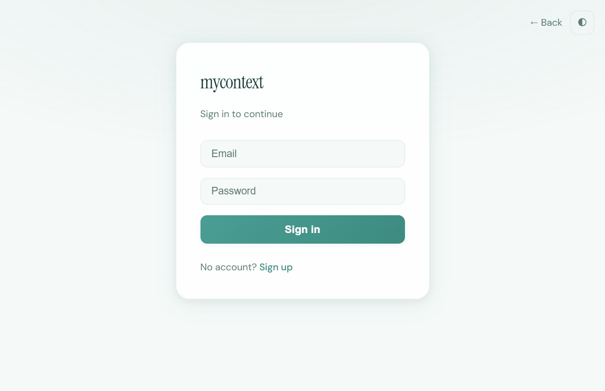
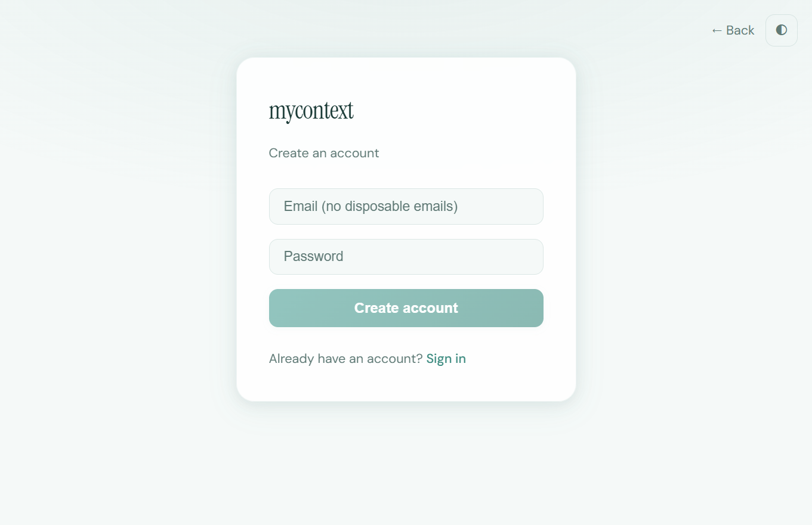

# Context Studio Tutorial

This tutorial walks you through the **Context Studio** web application — the visual interface for building and managing AI contexts. You'll learn the main screens, navigation, and key user flows.

## Quick Start

| Step | Action | Where |
|------|--------|-------|
| 1 | Open the app | [https://mycontext.sadhiraai.com](https://mycontext.sadhiraai.com) |
| 2 | Sign up or log in | **Get started free** or **Log in** |
| 3 | Go to Context Studio | **Context Studio** in the nav (or Launchpad card) |
| 4 | Build your first context | Choose **Manual** or **Copilot**, complete the 9-step wizard |
| 5 | Export or execute | **Ship It!** → Export to Markdown/JSON/LLM or Execute |

**Authentication flow (Landing → Login → Signup):**



---

## Prerequisites

- The Context Studio app at [https://mycontext.sadhiraai.com](https://mycontext.sadhiraai.com)
- Backend API running (required for signup, login, and authenticated features)

---

## 1. Landing Page

When you first visit the application, you see the **mycontext.ai** landing page.


### Key Elements

- **Header**: Logo, theme toggle (light/dark), **Log in**, and **Get started free** buttons
- **Tagline**: "Don't write prompts. Engineer contexts."
- **Value proposition**: Research-backed prompt flows, 87 cognitive frameworks, AI-driven copilot, multi-pattern composition, quality metrics, 13 export formats
- **Product links**: Try Context Studio, Meet the Copilot, Browse all patterns, Build your first chain, etc.

### User Actions

- **Log in** → Goes to `/login`
- **Get started free** → Goes to `/signup`
- **Try Context Studio** and similar CTAs → Redirect to signup for new users

---

## 2. Authentication Flow

### Sign Up



1. Click **Get started free** or **Try Context Studio** from the landing page
2. You'll see the **Create an account** form
3. Enter your **email** (no disposable emails allowed)
4. Enter a **password** that meets:
   - At least 8 characters
   - One uppercase letter
   - One lowercase letter
   - One digit
5. Click **Create account**
6. Check your email for a verification link (if email verification is enabled)

### Log In


1. Click **Log in** from the landing page
2. Enter your **email** and **password**
3. Click **Sign in**
4. You'll be redirected to the **Launchpad** (Dashboard)

### Navigation

- **← Back** returns to the landing page
- **Theme toggle** switches between light and dark mode
- **Sign up** / **Sign in** links switch between the two auth forms

---

## 3. Main Application Layout

After logging in, you see the main app with a persistent layout.

### Header Navigation

| Route | Label | Tier | Description |
|------|-------|------|--------------|
| `/` | Launchpad | Mission Control | Main dashboard |
| `/custom` | Context Studio | Novice | Build custom contexts with 9-step wizard |
| `/templates` | Cognitive Studio | Adept | Browse 85 research-backed patterns |
| `/chains` | Chain Composer | Architect | Compose multi-pattern analysis pipelines |

### User Menu (Cockpit)

Click your avatar/name in the top-right to open:

- **Profile** → Account page (`/account`)
- **Settings** → API keys, license, preferences (`/settings`)
- **Log out**

### Other Links

- **Academy** → Learning resources (`/academy`)

---

## 4. Launchpad (Dashboard)

The Launchpad is your home base after login.

### Hero Section

- Welcome message: "Welcome back, [name]"
- Tagline: "Your mission control for context engineering"
- Research quote: "The right context turns a language model into a domain expert"
- Stats: Number of cognitive patterns and custom contexts available

### Your Journey

Three cards for the main workflows:

1. **Context Studio** (Novice) — Build your first AI context with the guided wizard
2. **Cognitive Studio** (Adept) — Pick from 85 research-backed frameworks
3. **Chain Composer** (Architect) — Compose multiple patterns into pipelines

### Platform at a Glance

Stats cards: 85 Cognitive Patterns, 13 Export Formats, 6 Quality Metrics, 7 Orchestrators, 85 Generic Prompts, 3 Execution Tiers.

### Milestones

Checklist to track progress:

- Build your first context
- Try a cognitive pattern
- Compose a pattern chain
- Set API keys & license

---

## 5. Context Studio

**Path:** `/custom`

Context Studio lets you build prompts step-by-step with a research-backed 9-section flow.

### Two Paths

1. **Manual** — Fill each section yourself
2. **AI-driven (Copilot)** — Describe what you need in plain English; the Copilot suggests role, rules, thinking strategy, examples, and constraints

### 9-Step Wizard

| Step | Title | Purpose |
|------|-------|---------|
| 0 | Pick Your Adventure | Choose manual or Copilot |
| 1 | Give It a Name | Name your context |
| 2 | Who Should It Be? | Role and goal |
| 3 | House Rules | Rules the AI must follow |
| 4 | Teach It to Think | Thinking strategy |
| 5 | Shape the Answer | Output schema |
| 6 | Guard Rails | Constraints |
| 7 | The Big Ask | Task/directive |
| 8 | Ship It! | Save, export, or execute |

### Research Banner

A "Backed by Science" banner explains why section order matters — based on primacy/recency effects and instruction-following research.

### Export Formats

Export to: Markdown, JSON, YAML, OpenAI, Anthropic, Google, LangChain, LlamaIndex.

### Step-by-step: Build your first context

1. **Open Context Studio** — Click **Context Studio** in the header or the Launchpad card.
2. **Pick your path** — Choose **Manual** (fill each field yourself) or **Copilot** (describe in plain English; AI suggests content).
3. **Name it** — Give your context a name (e.g., "SWOT Analyzer").
4. **Define role & goal** — Who is the AI? What should it achieve? (e.g., "Expert Strategic Analyst" / "Analyze business opportunities").
5. **Add rules** — List rules the AI must follow (e.g., "Be concise", "Cite sources").
6. **Set thinking strategy** — How should it reason? (e.g., "Step-by-step", "Consider pros first").
7. **Shape output** — Define output schema (fields, types).
8. **Add guard rails** — Constraints (e.g., max length, forbidden topics).
9. **Write the task** — The main directive or question.
10. **Ship it** — Save, export to your preferred format, or execute.

---

## 6. Cognitive Studio

**Path:** `/templates`

Browse and use 85 research-backed cognitive patterns.

### Features

- **Search** — Find patterns by name or keyword
- **License filter** — Free vs. Enterprise
- **Pattern selector** — Choose a template (e.g., Root Cause Analyzer, SWOT, Code Reviewer)
- **Parameter form** — Fill template-specific inputs (e.g., `problem`, `depth`)
- **Build** — Compile the context
- **Export** — Copy as Markdown, JSON, YAML, or provider-specific format
- **Execute** — Run against your configured LLM (requires API key)

### Execution Modes

- **Static Generic** — Zero-cost pre-authored prompt
- **Dynamic Compiled** — LLM-refined prompt
- **Full Response** — Complete template execution

---

## 7. Chain Composer

**Path:** `/chains`

Compose multiple cognitive patterns into analysis pipelines.

### Modes

| Mode | Badge | Description |
|------|-------|-------------|
| Heuristic | Free | Keyword-based pattern matching, no API key |
| Smart | AI | LLM selects optimal chain from 87 patterns |
| Hybrid | Best | Combines heuristics + LLM reasoning |

### Flow

1. Enter your question (e.g., "Why did customer churn spike last quarter?")
2. Choose mode (Heuristic, Smart, or Hybrid)
3. Get suggested chain of patterns
4. Edit, reorder, or add patterns
5. Integrate and execute

---

## 8. Settings

**Path:** `/settings`

### Tabs

- **API Keys** — Add LLM provider keys (OpenAI, Anthropic, Google, etc.). Keys are stored encrypted. Set active provider and default model per provider.
- **License** — Activate Enterprise license for 69 advanced patterns
- **Preferences** — App preferences (e.g., guided tour reset)
- **Legal** — Terms, privacy, contact

### API Keys Flow

1. Select provider (OpenAI, Anthropic, Google, etc.)
2. Paste API key
3. Click Add
4. Set as active provider or default model as needed

---

## 9. Account & Profile

**Path:** `/account`

Manage your profile and account details.

---

## 10. Academy

**Path:** `/academy`

Learning resources, tutorials, and documentation links.

---

## Key User Flows Summary

### New User: First Context

1. Land on homepage → **Get started free**
2. Sign up → Verify email (if required)
3. Log in → Launchpad
4. Click **Context Studio** or **Take the guided tour**
5. Choose **Manual** or **Copilot**
6. Complete 9-step wizard
7. Save or export context

### Existing User: Use a Cognitive Pattern

1. Log in → Launchpad
2. Click **Cognitive Studio**
3. Search or browse patterns
4. Select pattern (e.g., Root Cause Analyzer)
5. Fill parameters
6. Build → Export or Execute

### Power User: Build a Chain

1. Log in → Launchpad
2. Click **Chain Composer**
3. Enter question
4. Choose Smart or Hybrid mode
5. Review suggested chain
6. Edit and integrate
7. Execute

### Configure LLM Access

1. User menu → **Settings**
2. **API Keys** tab
3. Add key for OpenAI, Anthropic, or Google
4. Set active provider
5. Use Execute in Cognitive Studio or Chain Composer

---

## Screenshots & Assets Reference

Assets in this tutorial are stored in `website/docs/tutorial/`:

| File | Description |
|------|-------------|
| `landing-page.png` | Landing page hero |
| `login-page.png` | Login form |
| `signup-page.png` | Sign up form |
| `auth-flow.gif` | Animated auth flow (Landing → Login → Signup) |
| `create_tutorial_gif.py` | Script to create GIFs from screenshot sequences |

---

## Creating GIFs for Key Workflows

### Option A: Python script (from screenshots)

A helper script creates animated GIFs from a sequence of PNG screenshots:

```bash
cd website/docs/tutorial
pip install Pillow
python create_tutorial_gif.py landing-page.png login-page.png signup-page.png -o auth-flow.gif -d 1200
```

**Workflow:**
1. Take screenshots of each step (e.g., with browser DevTools, Snipping Tool, or a screenshot tool)
2. Save them in order: `step1.png`, `step2.png`, ...
3. Run: `python create_tutorial_gif.py step1.png step2.png step3.png -o my-flow.gif`
4. Add to this doc: ``

**Options:** `-d 800` (frame duration ms), `--resize 800x600` (smaller file size)

### Option B: Screen recorder

For live demos (mouse movement, typing, transitions):

1. **Windows:** [ScreenToGif](https://www.screentogif.com/) (free) or [LICEcap](https://www.cockos.com/licecap/)
2. **macOS:** Built-in Cmd+Shift+5 → Record selected portion
3. Record the flow in the running app at `https://mycontext.sadhiraai.com`
4. Export as GIF
5. Save to `website/docs/tutorial/` and reference: ``

---

## Troubleshooting

- **"Server error" on signup** — Ensure the backend API is running and database is configured
- **Redirect to login** — Session expired or not logged in; log in again
- **Execute grayed out** — Add an API key in Settings → API Keys
- **Enterprise patterns locked** — Activate Enterprise license in Settings → License
